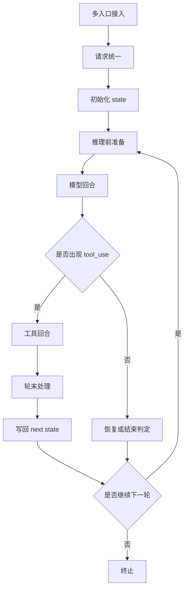

## 写在前面

Claude Code 推出后，业界便一直有人从多维度探究其出色体验的原因，包括Claude 也经常对外分享其设计思路。如今源码泄露，各类解读更是层出不穷，但质量参差不齐、视角各异 —— 要么过于细碎，要么过于笼统，往往我们真正关心的内容寥寥，信息熵较低，不如结合自身需求与业务特性，自己扒一扒源码

与很多的源码分析不同，本文档将聚焦 Agent 视角，只关心Agent 及其配套的实现思路、边界划分（模块边界与人机边界），以及 Agent 工程化实践中，如何提升智能上限、保障执行确定性、平衡推理成本，并提炼可与自身业务结合的借鉴思路

- **不涉及内容**：具体工程架构、代码实现、编程语言、技术细节等

## 整体感受列在前面

- **模型能力先行**：模型通用能力先行，面向模型能力做设计开发，依托模型 强大的通用能力 实现工程和模型的解耦（反例则是 模型等业务，业务等模型，循环依赖，踟蹰不前）
- **智能优先，成本控制隐藏**：模型推理上不限制 Token 消耗以释放模型性能上限给用户以更智能的体验，工程侧通过分层缓存、上下文懒加载和动态预算调整，系统性控制整体推理成本
- **核心内聚+ 旁路观测**：主流程采用单一全局状态的同步状态机架构，所有状态变更显式可控；可观测系统作为纯旁路，通过事件化机制消费状态变更，与核心逻辑完全解耦
- **统一运行时 + 按需分叉的多 Agent**：所有 Agent 共享同一套底层执行引擎，通过配置定义职责；严格遵循 "非必要不创建子 Agent" 原则，仅在确有收益时才分叉出同步、后台或隔离形态的子 Agent。这一范式对 Super Agent 的通用决策能力要求极高，是 Claude Code 区别于其他多 Agent 系统的核心特征
- **信息按需加载原则**：充分信任模型的判断能力，将长文本封装为索引、预览等轻量代理标识供模型筛选；仅当模型明确确认信息有用时，才由系统加载并注入完整原始内容。永远不要让模型看到它没有明确要求的信息。系统的职责不是 "把所有可能有用的信息都给模型"，而是 "在模型明确表示需要某条信息时，能够快速准确地把它找出来"
- **单一循环极简主义**：整个系统只有一个主循环、一个状态记录、一个执行入口。任何新功能都是这个循环的一个状态分支，而不是一条独立的执行链路
- **系统提供确定性**：模型负责概率性的智能决策，系统负责保证确定性。系统负责状态管理、工具执行、参数校验、权限治理、缓存、可观测性和生命周期管理；模型负责判断要不要调工具、调哪个工具、要不要开子 Agent、哪些记忆相关、怎么总结内容

## 1. AgentRuntime

### 1.1 整体介绍

这一章主要讲 Claude Code的多入口处理和Agent运行时逻辑。入口层负责把不同调用方式收敛为统一请求，运行时负责把这份请求不断推进为下一轮状态。上下文会在Runtime被消费同时生成新的上下文原料，但这个过程在本章一笔带过，第二章节专门进行介绍

统一接口层屏蔽多来源，将不同来源的不同的请求数据归一化为Agent request, 而非为每一种来源独立创建Agent 逻辑

claude code 的Runtime 主要是一个 由代码控制、状态机驱动的 ReAct 运行时 (不同于prompt ReAct)

其中最重要的是state 这个 统一状态对象 ,每轮通过读取当前 state、执行本轮逻辑、根据条件分支生成 next state，再用 state = next 推进到下一轮

另外，claude code 的plan 模式并不会开启另外一条新的主流程，而是把当前的运行时权限切换为 plan,  通过模型调用plan tool , 并通过tool result 和 attachment 注入规划指令，使得主流程被切换到一种plan mode 运行态

这样的设计，始终贯彻了高内聚、禁止业务碎片化的核心原则。而这正是我们从过往工程实现中吸取的重要教训：在 XP 系统中，常见做法是为单个业务从头到尾新建独立链路，最终造成链路割裂、逻辑复杂难以维护，更导致数据无法回流，Agent 因 数据治理失效 而表现出能力低下，典型如主动 Bot、自主思考、基于列表继承的 “多轮” 等场景。因此在架构设计上，必须谨慎新开逻辑分支，坚决避免分支泛滥

### 1.2 整体流程图



### 1.3 具体流程

#### 1.3.1 多入口接入

Claude Code 不是单一 CLI，而是把多种入口统一收敛到同一个运行时，包括 CLI、MCP、本机 SDK 和网络服务化入口

#### 1.3.2 请求统一

多来源的请求会先统一进入 messages，随后完成 context 组装，并最终封装进 QueryParams，交给同一个 query() 主循环。

#### 1.3.3 主循环状态机

query.ts 用 state 运行时状态容器，每一轮从 state 中取出消息列表、工具上下文、turn 计数与恢复标记，处理完成后再写回新的 next state。这说明主循环不是普通函数链，而是显式状态机。

```ts
// 定义并初始化一个 state 变量，类型为 State
let state: State = {
  // 保存消息列表，保存所有的对话历史
  messages: params.messages,

  // 保存工具相关的状态，包含可用工具、Schema、调用策略、附加状态
  toolUseContext: params.toolUseContext,
  maxOutputTokensOverride: params.maxOutputTokensOverride,
  autoCompactTracking: undefined,
  stopHookActive: undefined,
  maxOutputTokensRecoveryCount: 0,
  hasAttemptedReactiveCompact: false,
  turnCount: 1,
  pendingToolUseSummary: undefined,
  transition: undefined,
}

// 启动一个“相关记忆预取”任务，并用 using 管理其生命周期
using pendingMemoryPrefetch = startRelevantMemoryPrefetch(
  state.messages,state.toolUseContext,)

// 进入一个无限循环，通常表示主处理流程会持续执行，直到内部 break / return
while (true) {
  // 从 state 中取出 toolUseContext，方便后续单独使用
  let { toolUseContext } = state

  // 从 state 中解构出多个字段，便于在当前循环内直接访问
  const {
    messages,
    autoCompactTracking,
    maxOutputTokensRecoveryCount,
    hasAttemptedReactiveCompact,
    maxOutputTokensOverride,
    pendingToolUseSummary,
    stopHookActive,
    turnCount,
  } = state

```

#### 1.3.4 推理前准备

进入模型前，主循环会先整理出这一轮真正用于推理的输入窗口，并完成必要的上下文装配与预算控制。这里先只看它在做“推理前准备”，具体的上下文生成、获取与治理策略放到下一章单独展开

#### 1.3.5 模型回合

在一次模型回合里，系统先准备好输入消息、system prompt，以及当前可用的工具和 thinking 配置，然后调用模型并以流式方式接收输出。模型返回的 assistant 消息里，通常会包含不同类型的内容块，比较关键的是 thinking、text 和 tool_use。

其中，thinking 是模型的思考内容，主要用于流式展示和后续上下文保留；text 是普通的自然语言回复，也就是用户最终会看到的文本内容；tool_use 则表示模型在这一轮里决定调用工具。系统在流式接收 assistant 消息后，会先把消息保存下来，再检查其中是否包含 tool_use。如果没有，那么这轮生成出来的 text 基本就可以看作当前回合的最终回复；如果有，就会把这些工具调用提取出来并执行，再把工具结果补回消息历史中，进入下一轮模型回合，让模型继续基于工具结果完成后续回复。

```ts
// src/query.ts
for await (const message of deps.callModel({
  messages: prependUserContext(messagesForQuery, userContext),
  systemPrompt: fullSystemPrompt,
  thinkingConfig: toolUseContext.options.thinkingConfig,
  tools: toolUseContext.options.tools,
  signal: toolUseContext.abortController.signal,
  options: { ... },
})) {
  if (message.type === 'assistant') {
    assistantMessages.push(message)

    const msgToolUseBlocks = message.message.content.filter(
      content => content.type === 'tool_use',
    ) as ToolUseBlock[]
    if (msgToolUseBlocks.length > 0) {
      toolUseBlocks.push(...msgToolUseBlocks)
      needsFollowUp = true
    }
  }
}
```

#### 1.3.6 工具回合与轮末处理

工具执行结束后，主循环不会立刻进入下一轮，而是先补充本轮产生的 attachments、消费异步预取到的附加信息，并刷新工具池，然后再生成下一轮状态。

```ts
// src/query.ts
for await (const attachment of getAttachmentMessages(
  null,
  updatedToolUseContext,
  null,
  queuedCommandsSnapshot,
  [...messagesForQuery, ...assistantMessages, ...toolResults],
  querySource,
)) {
  yield attachment
  toolResults.push(attachment)
}
...
const next: State = {
  messages: [...messagesForQuery, ...assistantMessages, ...toolResults],
  toolUseContext: toolUseContextWithQueryTracking,
  ...
  turnCount: turnCount + 1,
  transition: { reason: 'next_turn' },
}
state = next
```

#### 1.3.7 恢复与终止

当本轮调用返回 413 或 media size 等可恢复错误时，主循环会优先进入恢复分支，而不是立即终止。恢复分支会调用 reactiveCompact.tryReactiveCompact(...)，基于当前 messagesForQuery 进行一次响应式压缩，再把压缩后的结果作为新的输入继续后续回合。这样做的目的，是尽量把“因上下文过长或媒体过大导致的失败”转化为一次可继续推进的重试。只有当恢复没有成功，或者命中了 maxTurns、abort、hook stop 等不可继续的终止条件时，主循环才返回结构化的结束状态

```ts
// src/query.ts
if ((isWithheld413 || isWithheldMedia) && reactiveCompact) {
  const compacted = await reactiveCompact.tryReactiveCompact({
    hasAttempted: hasAttemptedReactiveCompact,
    querySource,
    aborted: toolUseContext.abortController.signal.aborted,
    messages: messagesForQuery,
    cacheSafeParams: {
      systemPrompt,
      userContext,
      systemContext,
      toolUseContext,
      forkContextMessages: messagesForQuery,
    },
  })
  ...
}
```

## 2. Context Engineering

### 2.1 整体介绍

Context 系统负责上下文数据的生成、获取、组装与预算治理。它把 system prompt、基础规则上下文、环境信息和会话历史分层处理，再通过 compact 链路控制成本。这里既包含“基础上下文从哪里来”，也包含“进入模型前如何被重写”；而按需记忆召回会在第五章单独展开。

### 2.3 具体流程

#### 2.3.1 用户请求

入口首先把 本轮用户请求 追加到 messages。这里的 messages 跟我们的常见的chatmessageList没有本质区别，包含 assistant、tool_result、attachment、system message 等。

```
[
{ type: 'user', ... },
{ type: 'assistant', ... },
{ type: 'attachment', ... },
{ type: 'system', ... },
{ type: 'user', ... }
]
```

当然这个是框架层的抽象，并不是给到模型的时候也是多了attachment标签，可能转换成user 文本块或者content 文本块来实现

#### 2.3.2 推理环境装配

这一步主要装配的不是上下文内容本身，而是“这一轮推理能在什么环境里运行”。更准确地说，它可以拆成三类：

- **可见工具列表**：系统会先根据当前权限模式拿到可用工具列表，再按运行模式继续过滤；如果开启结构化输出，还会把 SyntheticOutputTool 动态加入工具池。
- **模型推理配置**：这里会确定 Model、thinkingConfig、交互模式，以及 budget 一类运行参数。
- **执行运行时环境**：tool运行环境。这里会把 mcpClients、agentDefinitions、getAppState / setAppState、abortController、readFileState、canUseTool、toolPermissionContext 等能力装配进 ToolUseContext。
- **这样和“上下文组装”的边界就清楚了**：这一节回答的是“模型在什么环境里运行”，下一小节回答的是“模型到底看什么内容”。

```ts
// src/main.tsx
maybeActivateProactive(options);
let tools = getTools(toolPermissionContext);

if (feature('COORDINATOR_MODE') && isEnvTruthy(process.env.CLAUDE_CODE_COORDINATOR_MODE)) {
  const { applyCoordinatorToolFilter } = await import('./utils/toolPool.js');
  tools = applyCoordinatorToolFilter(tools);
}

if (jsonSchema) {
  const syntheticOutputResult = createSyntheticOutputTool(jsonSchema);
  if ('tool' in syntheticOutputResult) {
    tools = [...tools, syntheticOutputResult.tool];
  }
}

// src/QueryEngine.ts
processUserInputContext = {
  messages,
  setMessages: () => {},
  onChangeAPIKey: () => {},
  handleElicitation: this.config.handleElicitation,
  options: {
    commands,
    debug: false,
    tools,
    verbose,
    mainLoopModel,
    thinkingConfig: initialThinkingConfig,
    mcpClients,
    mcpResources: {},
    ideInstallationStatus: null,
    isNonInteractiveSession: true,
    customSystemPrompt,
    appendSystemPrompt,
    theme: resolveThemeSetting(getGlobalConfig().theme),
    agentDefinitions: { activeAgents: agents, allAgents: [] },
    maxBudgetUsd,
  },
  getAppState,
  setAppState,
  abortController: this.abortController,
  readFileState: this.readFileState,
  ...
}
```

#### 2.3.3 上下文装箱

将模型上下文所需要的 所有物料装箱打包。

在进入 query() 准循环前，系统会先拿到 systemPrompt、userContext、systemContext，再和 messages、ToolUseContext 一起封装进 QueryParams。这里的 systemPrompt 是基础行为规则，systemContext 是 git status、cache breaker 这类会话环境补充，它会在进入模型前再拼接到 systemPrompt 上；userContext 则承载 CLAUDE.md 与日期等稳定用户规则。

这里打包的环境信息类，跟Task类似，给出的都是某类环境状态信息

```ts
// src/QueryEngine.ts
const {
  defaultSystemPrompt,
  userContext: baseUserContext,
  systemContext,
} = await fetchSystemPromptParts({
  tools,
  mainLoopModel: initialMainLoopModel,
  additionalWorkingDirectories: Array.from(
    initialAppState.toolPermissionContext.additionalWorkingDirectories.keys(),
  ),
  mcpClients,
  customSystemPrompt: customPrompt,
})

const userContext = {
  ...baseUserContext,
  ...getCoordinatorUserContext(
    mcpClients,
    isScratchpadEnabled() ? getScratchpadDir() : undefined,
  ),
}

// src/context.ts
export const getSystemContext = memoize(
  async (): Promise<{
    [k: string]: string
  }> => {
    const gitStatus =
      isEnvTruthy(process.env.CLAUDE_CODE_REMOTE) ||
      !shouldIncludeGitInstructions()
        ? null
        : await getGitStatus()

    const injection = feature('BREAK_CACHE_COMMAND')
      ? getSystemPromptInjection()
      : null

    return {
      ...(gitStatus && { gitStatus }),
      ...(feature('BREAK_CACHE_COMMAND') && injection
        ? {
            cacheBreaker: `[CACHE_BREAKER: ${injection}]`,
          }
        : {}),
    }
  },
)

export const getUserContext = memoize(
  async (): Promise<{
    [k: string]: string
  }> => {
    const shouldDisableClaudeMd =
      isEnvTruthy(process.env.CLAUDE_CODE_DISABLE_CLAUDE_MDS) ||
      (isBareMode() && getAdditionalDirectoriesForClaudeMd().length === 0)
    const claudeMd = shouldDisableClaudeMd
      ? null
      : getClaudeMds(filterInjectedMemoryFiles(await getMemoryFiles()))

    return {
      ...(claudeMd && { claudeMd }),
      currentDate: `Today's date is ${getLocalISODate()}.`,
    }
  },
)

// src/QueryEngine.ts
for await (const message of query({
  messages,
  systemPrompt,
  userContext,
  systemContext,
  canUseTool: wrappedCanUseTool,
  toolUseContext: processUserInputContext,
  fallbackModel,
  querySource: 'sdk',
  maxTurns,
  taskBudget,
})) {

// src/query.ts
const fullSystemPrompt = asSystemPrompt(
  appendSystemContext(systemPrompt, systemContext),
)
```

#### 2.3.4 上下文整理策略

进入主循环后，不是直接拿完整历史去推理，而是先裁出有效窗口，再通过一整套预算治理与压缩链把真正要送给模型的上下文整理成 messagesForQuery。这里的重点不是“尽量压缩”，而是在预算内尽量保留高价值信息

**历史范围裁剪**

确定这一轮应该从哪段历史开始看。这里采用的不是时间衰减，也不是固定时间窗口，而是 边界截断：系统会从消息历史里找到最近一次 compact boundary，把这条边界之前的内容视为已经总结过的历史，不再继续带入当前轮

```
[
  { type: 'user', content: '帮我分析仓库结构' },
  { type: 'assistant', content: '开始阅读入口代码' },
  { type: 'tool_result', content: 'main.tsx 内容很长...' },
  { type: 'assistant', content: '我整理出了入口层结构' },
  { type: 'user', content: '继续分析 Agent Loop' },
  { type: 'assistant', content: '开始阅读主循环' },
  { type: 'tool_result', content: '主循环代码内容很长...' },
  { type: 'assistant', content: '我整理出了第一章' },
  { type: 'system', subtype: 'compact_boundary' },
  { type: 'assist    ant', content: '前面历史的摘要' },
  { type: 'tool_result', content: 'query.ts 内容很长...' },
  { type: 'user', content: '继续分析 Context Engineering' },
  { type: 'assistant', content: '开始看上下文系统' }
]
```

**经过compact boundary 裁剪之后的结果：**

```
[
  { type: 'system', subtype: 'compact_boundary' },
  { type: 'assistant', content: '前面历史的摘要' },
  { type: 'tool_result', content: 'query.ts 内容很长...' },
  { type: 'user', content: '继续分析 Context Engineering' },
  { type: 'assistant', content: '开始看上下文系统' }
]
```

**工具结果瘦身**

专门处理特别大的工具输出。做法是把那些又长、又不值得原样保留的结果换成更短的替代内容，避免一两个超大结果把整个上下文空间挤满。

单个过长工具，则替换为

1. 一个结构化占位
2. 加文件路径(可以按需查看原始内容)
3. 加预览片段

```
<persisted-output>
Output too large (300 KB). Full output saved to: /path/to/session/tool-results/toolu_123.txt

Preview (first 2 KB):
src/query.ts:1 import type { ToolResultBlockParam } from ...
src/query.ts:2 import type { CanUseToolFn } from ...
src/query.ts:3 import { FallbackTriggeredError } from ...
...

</persisted-output>
```

更久的工具，则直接替换为占位消息

```
[Old tool result content cleared]
```

**局部裁剪**

即使超大的工具结果已经被瘦身，活跃窗口本身仍然可能因为累计了太多旧消息而继续膨胀。这时系统会在当前活跃窗口内部，再把一部分较旧的消息片段移出去。这里处理的不是单个 tool result，而是整段旧消息，工具结果只是其中的一部分。被移出的内容不会继续参与当前轮推理，但原始历史仍然保留

**结构化折叠**

再往下会对旧内容做更细的清理。更早上下文折成更紧凑的可恢复视图，可能是将每一条内容折叠成短凑的内容，但那条消息还在，且可以通过系统存储的原始文本进行恢复

**整轮摘要压缩**

如果前面的整理还不够，才会进入整轮摘要压缩。做法是把当前整段消息历史拿出来，额外发起一次“请总结这段对话”的请求，让模型先产出一份摘要，再用摘要替换长历史。

```ts
const PARTIAL_COMPACT_PROMPT = `Your task is to create a detailed summary of the RECENT portion of the conversation...`
```

#### 2.3.5 并行预取

memory recall 和 skill discovery 不是首轮硬依赖，因此 Claude Code 不会在模型启动前同步等待它们，而是把它们作为 side work 并行准备。memory prefetch 在 query 入口启动一次，skill prefetch 则在每轮开始时启动。

**这样做的原因和可行性：**

1. memory recall 和skill discovery 不是首次推理所必须的，是属于增益内容

**这些数据的获取是有成本的：**

1. 找最近用户请求
2. 扫描候选 memory，skill
3. 做相关性筛选

4. 同步等待这些数据会造成首token的延迟

5. claude code 是 强多轮推理 完成任务，首轮可能并不需要深入处理信息，因此并不必要首次获取全量信息

#### 2.3.6 轮末注入

一轮结束后，系统检查系统命令、memory prefetch、skill prefetch 是否有 ready 的结果；有的话，就把它们包装成 attachment message 挂回messages ，供下一轮推理使用。这里的 attachment 是运行时补充给模型的结构化上下文载体，memory recall、skill discovery、queued commands 等

```ts
// src/utils/attachments.ts
export async function* getAttachmentMessages(
  input: string | null,
  toolUseContext: ToolUseContext,
  ideSelection: IDESelection | null,
  queuedCommands: QueuedCommand[],
  messages?: Message[],
  querySource?: QuerySource,
  options?: { skipSkillDiscovery?: boolean },
): AsyncGenerator<AttachmentMessage, void> {
  const attachments = await getAttachments(
    input,
    toolUseContext,
    ideSelection,
    queuedCommands,
    messages,
    querySource,
    options,
  )
  ...
}
```

### 2.4 Prompt Cache

Prompt cache 是Agent工程中非常重要的一件事情，保持尽可能多kv-cache 命中，不仅可以加快模型推理的速度，还节省推理成本，节省花费，这不是上下文中单独的模块去做的，而是整个系统设计的时候需要全局来考虑的事情

这部分内容我认为是当前时代Agent开发非常重要一部分内容，也是我们在600 整个系统设计中还无暇顾及，也无法兼顾的基础能力，反思其原因在于：

- **架构层面**：无统一系统设计、无统一上下文管理、多模型混用、Agent 动态上下文无序，导致无法构建稳定可复用的缓存前缀
- **模型策略层面**：对 Agent 的认知仍停留在传统 NLP 时代，技术思路过度依赖针对各类场景微调垂类模型，而非通过强化基座模型的通用能力来覆盖垂类业务。这直接导致模型与业务逻辑深度耦合，Prompt 必须高度定制化、碎片化且频繁动态变化，无法形成统一、稳定、可复用的上下文前缀，进一步让缓存失去可行性

**静态/动态边界**

把 system prompt 切成静态段和动态段，尽量让前缀稳定，从而提高缓存命中率。

```ts
// src/constants/prompts.ts
export async function getSystemPrompt(
  tools: Tools,
  model: string,
  additionalWorkingDirectories?: string[],
  mcpClients?: MCPServerConnection[],
): Promise<string[]> {
  return [
    // --- 静态内容（可缓存）---
    getSimpleIntroSection(outputStyleConfig),
    getSimpleSystemSection(),
    getSimpleDoingTasksSection(),
    getActionsSection(),
    getUsingYourToolsSection(enabledTools),
    getSimpleToneAndStyleSection(),
    getOutputEfficiencySection(),

    // === 缓存边界 ===
    ...(shouldUseGlobalCacheScope() ? [SYSTEM_PROMPT_DYNAMIC_BOUNDARY] : []),

    // --- 动态内容（每次不同）---
    ...resolvedDynamicSections,
  ].filter(s => s !== null)
}
```

**fork agent or sub agent复用主Agent 前缀**

在subagent  or fork agent 等场景里尽量复用主线程的前缀

```ts
// prompt cache by sending identical cache-key params (system, tools, model,
// messages prefix, thinking config)
```

**主线程可能是：**

1. system prompt
2. tools
3. 历史 messages
4. 当前用户请求

**compact fork 可能是：**

1. system prompt
2. tools
3. 同一段历史 messages 前缀
4. 最后追加一个“请总结这段历史”的请求

**上下文改写保持字节稳定**

在上下文压缩和内容替换时保持保持字节稳定。

* `replacement` is the exact string the model saw — stored rather than
* derived on resume so code changes to the preview template, size formatting,
* or path layout can't silently break prompt cache.

```ts
state.replacements.set(toolUseId, replacement.content)
```

**举例来说：**

```
{
  type: 'tool_result',
  tool_use_id: 'toolu_123',
  content: '... 300KB 的长输出 ...'
}
```

这段工具在某一轮的上下文压缩中被处理成了如下内容，这个替换虽然只发生在active context中，但是这个被替换内容，需要保存下来，且不能更改：

```
<persisted-output>
Output too large (300 KB). Full output saved to: /tmp/session/tool-results/toolu_123.txt

Preview (first 2 KB):
src/query.ts:1 import type { ToolResultBlockParam } from ...
...

</persisted-output>
```

这个替换内容不能 不重新算文案，不能重新格式化，不重新生成略有不同的 preview 模板，要保证完全一样

**不能换成这个样子：**

```
<persisted-output>
Output too large (300 KB). Saved to /tmp/session/tool-results/toolu_123.txt

Preview (first 2048 bytes):
...

</persisted-output>
```

**缓存编辑**

使用Anthropic API中的提供的cache-eidt 能力，实现提交变动diff, 推理框架编辑kv-cache ，实现cache的复用

```ts
// Cached microcompact path - uses cache editing API to remove tool results
// without invalidating the cached prefix.

// Return messages unchanged - cache_reference and cache_edits are added at API layer
```

举例来说

```
[
  { type: 'user', content: '帮我分析 query.ts' },
  { type: 'assistant', content: '我先读取文件' },
  { type: 'tool_result', tool_use_id: 'toolu_1', content: 'query.ts 的超长内容 ... 100KB' },
  { type: 'assistant', content: '我看完了，继续分析' },
  { type: 'tool_result', tool_use_id: 'toolu_2', content: '另一个超长结果 ... 80KB' },
  { type: 'user', content: '继续往下看' }
]
```

**但发给 API 时，会额外附带类似这种意思的编辑指令：**

```ts
cache_edits = [
  { delete_tool_result: 'toolu_1' },
  { delete_tool_result: 'toolu_2' }
]
```

推理框架支持基于块缓存技术支持kv-cache的可编辑剔除，保证很高的命中率，这是anthropic 为了agent 提供的底层控制能力，其他家目前都未提供这样的能力

**Prompt Cache 失效监控**

同时系统还会记录 cache break，分析是 system、tools、model、betas 还是其他因素导致缓存失效

## 3. 工具系统

### 3.1 整体介绍

工具系统真正做的，不只是“把工具跑起来”，而是把“执行能力”转换成“模型能安全理解并继续推理的结构化结果”。工具调用从来不是模型说调就直接执行，中间还要经过参数校验、权限决策、hooks、执行、结果映射、失败处理等多个环节。

**这一章的主线可以概括成六步：**

1. 工具从哪里来。
2. 为什么按现在这个粒度抽象。
3. Tool 对象本身定义了哪些能力。
4. 输入如何校验。
5. 权限如何治理。
6. 结果怎样回写到主循环里。

下面几节其实就是沿着这条链一层层展开。

**我们先看我们比较关心的几个问题：**

1. **工具执行为什么要做成异步?** 原因不只是流式输出，而是工具面对的本来就是文件、Shell、MCP、网络、权限确认、hooks 这类天然异步的外部动作，因此执行层必须设计成 async pipeline。不过在 Agent loop 的控制流层面，它仍然是回合式同步等待：主循环会等这一轮 tool_use 产出结果后，再进入下一轮模型推理。
2. **工具结果为什么不能直接裸返回给模型?** 原因是模型并不认识工具内部的数据结构，所以工具系统要求每个工具都实现 mapToolResultToToolResultBlockParam(...)，把内部结果映射成统一的 tool_result 内容块。也就是说，工具内部可以返回复杂对象，但回给模型之前必须经过一层“结果可解释化”。
3. **MCP 工具为什么也需要这层映射?** MCP server 提供的是实际执行能力，不是模型可直接消费的最终语义。Claude Code 会先通过 MCPTool 调用 MCP，拿到原始返回结果，再由 MCPTool 的映射逻辑把它翻译成统一的 tool_result 内容，最后再回填到消息链里。也就是说，MCP 负责执行，Claude Code 工具系统负责语义适配。
4. **为什么每次工具调用都必须有结果返回?** 对 Agent loop 来说，最怕的不是工具失败，而是工具调用后没有结果。成功时需要回填成功结果，失败时也需要回填失败结果、拒绝结果或取消结果，否则这次 tool_use 在消息链里就是悬空的，下一轮模型无法稳定继续推理。

### 3.2 具体流程

#### 3.2.1 工具来源

给到 Agent 的可用工具，不只是 Claude Code 自己的 built-in tools，也包括通过 MCP 接进来的外部工具，以及当前运行单元一开始就继承进来的 initialTools。

**这三类来源可以这样理解：**

- **built-in tools**：内置原生定义的工具集合，例如 FileRead、Edit、Bash、AgentTool 等
- **mcp tools**：外部工具。它们不是独立于工具系统的另一套执行逻辑，而是外部来源的工具能力，后面仍然要并入同一个工具池。
- **initialTools**：当前会话、REPL、fork 子运行单元或恢复过程一开始就已经带进来的那批工具快照，里面既可能包含 built-in，也可能包含启动时已有的 MCP tools。

```ts
// src/hooks/useMergedTools.ts
export function useMergedTools(
  initialTools: Tools,
  mcpTools: Tools,
  toolPermissionContext: ToolPermissionContext,
): Tools {
  return useMemo(() => {
    const assembled = assembleToolPool(toolPermissionContext, mcpTools)

    return mergeAndFilterTools(
      initialTools,
      assembled,
      toolPermissionContext.mode,
    )
  }, [
    initialTools,
    mcpTools,
    toolPermissionContext,
    replBridgeEnabled,
    replBridgeOutboundOnly,
  ])
}

// src/tools.ts
export function assembleToolPool(
  permissionContext: ToolPermissionContext,
  mcpTools: Tools,
): Tools {
  const builtInTools = getTools(permissionContext)
  const allowedMcpTools = filterToolsByDenyRules(mcpTools, permissionContext)

  const byName = (a: Tool, b: Tool) => a.name.localeCompare(b.name)
  return uniqBy(
    [...builtInTools].sort(byName).concat(allowedMcpTools.sort(byName)),
    'name',
  )
}

```

此处可借鉴的是，当前设计中应该只是 来自于CDCU的MCP Tools, Agent 应该有自己的built-in tools

#### 3.2.2 工具抽象粒度

Claude Code 里的工具，不是按 API 或实现模块来切的，而是按“模型可理解、权限可治理、结果可回填”的动作单元来切的。也就是说，一个功能该不该单独做成工具，核心不看代码实现是否能复用，而看它在 Agent 运行时里是否构成一个独立动作语义

**从现有工具拆分就能看出这种粒度观：**

Read、Edit、Write 分开，Glob 和 Grep 分开，TaskCreate、TaskUpdate、TaskList、TaskGet 分开，EnterPlanMode 和 ExitPlanMode 分开

```ts
// src/constants/prompts.ts
const providedToolSubitems = [
  `To read files use ${FILE_READ_TOOL_NAME} instead of cat, head, tail, or sed`,
  `To edit files use ${FILE_EDIT_TOOL_NAME} instead of sed or awk`,
  `To create files use ${FILE_WRITE_TOOL_NAME} instead of cat with heredoc or echo redirection`,
  ...(embedded
    ? []
    : [
        `To search for files use ${GLOB_TOOL_NAME} instead of find or ls`,
        `To search the content of files, use ${GREP_TOOL_NAME} instead of grep or rg`,
      ]),
  `Reserve using the ${BASH_TOOL_NAME} exclusively for system commands and terminal operations that require shell execution. If you are unsure and there is a relevant dedicated tool, default to using the dedicated tool and only fallback on using the ${BASH_TOOL_NAME} tool for these if it is absolutely necessary.`,
]
```

这说明 Claude Code 倾向于把一种清晰、单一、可命名的 动作 抽成一个工具，而不是把很多动作塞进一个“大而全工具”。

**从代码和 prompt 里，可以总结出这套工具抽象的核心原则：**

1. 按动作语义拆，而不是按实现复用拆。如果两个能力在模型看来是不同动作，就倾向拆成两个工具。
2. 按权限与风险边界拆。如果两个动作的权限语义、只读/写入语义、破坏性差异明显，就不应该放在同一个工具里。
3. 按输入 schema 是否稳定单一来拆。如果一个工具需要很多互斥模式、很多分叉字段，通常说明粒度太粗，适合继续拆分。
4. 按结果语义拆。如果输出结果需要模型以完全不同方式理解，也更适合拆成不同工具。
5. 按用户是否容易理解和审计来拆。Claude Code 在 system prompt 里明确要求模型优先使用 dedicated tools 而不是 Bash，本质上就是希望每次 tool_use 的动作意图足够清晰，便于用户理解、权限审核和 transcript 阅读。

倾向保留为一个工具，如果它们只是这些差异

1. 同一动作的小参数变化
2. 同一资源上的不同选项
3. 同一权限语义下的执行细节差异
4. 同一种结果表达，只是字段多少不同

- **所以可以用一句话概括**：在 Claude Code 里，一个功能应该抽象成一个工具，前提是它构成了一个独立的动作语义；如果一个功能内部混杂了多种权限边界、输入形态和结果语义，那更适合拆成多个工具，而不是塞进一个“万能工具”；同一动作的参数化变体”留在一个工具里

#### 3.2.3 工具定义

Claude Code 内置工具并不是直接按 MCP 原生 schema 来定义的，而是遵循自己更完整的 Tool 抽象。MCP 更像“外部工具接入协议”，而 Claude Code 的 Tool 抽象则是“运行时里的完整工具对象”。

- **这一节只回答一个问题**：一个 Tool 对象本身需要带哪些能力。至于这些能力在运行时里按什么顺序被调用，比如先校验、再权限、再执行、再回写，会放到后面几小节单独展开。

如果只看模型可见层，一个工具当然也需要 name、description、input schema，这一点和 MCP 很像；但 Claude Code 对工具的要求远不止这些。一个工具至少要回答下面几类问题：

- **这个工具是什么、什么时候该用**：通过 name 和 description(...) 向模型暴露工具语义，必要时再通过 prompt(...) 提供更完整的使用说明。
- **这个工具怎么执行**：通过 call(...) 真正运行工具逻辑。
- **这个工具接收什么输入**：通过 inputSchema 定义输入结构，必要时还可以直接提供 inputJSONSchema。
- **这个工具何时可用、是否只读、是否可并发、是否需要权限**：通过 isEnabled、isReadOnly、isConcurrencySafe、checkPermissions 等方法表达运行时语义。
- **这个工具的输入是否合法**：通过 validateInput(...) 做工具级校验。
- **这个工具的结果如何回给模型**：通过 mapToolResultToToolResultBlockParam(...) 把内部执行结果翻译成统一的 tool_result 内容块。
- **这个工具在 UI 里怎么展示**：通过 userFacingName、renderToolUseMessage、renderToolResultMessage 等方法把执行层和展示层连起来。
- **所以可以把两者的关系概括成**：MCP schema 更像“如何把工具暴露给模型”，Claude Code 的 Tool 抽象更像“如何让工具在整个运行时里被调用、治理、展示、回填”。也正因为如此，哪怕是 MCP 工具，接进来之后也要被包装成 Claude Code 自己的 Tool 形态，才能进入统一工具系统。

```ts
// src/Tool.ts
export type Tool<
  Input extends AnyObject = AnyObject,
  Output = unknown,
  P extends ToolProgressData = ToolProgressData,
> = {
  call(
    args: z.infer<Input>,
    context: ToolUseContext,
    canUseTool: CanUseToolFn,
    parentMessage: AssistantMessage,
    onProgress?: ToolCallProgress<P>,
  ): Promise<ToolResult<Output>>
  description(
    input: z.infer<Input>,
    options: {
      isNonInteractiveSession: boolean
      toolPermissionContext: ToolPermissionContext
      tools: Tools
    },
  ): Promise<string>
  readonly inputSchema: Input
  readonly inputJSONSchema?: ToolInputJSONSchema
  outputSchema?: z.ZodType<unknown>
  isConcurrencySafe(input: z.infer<Input>): boolean
  isEnabled(): boolean
  isReadOnly(input: z.infer<Input>): boolean
  validateInput?(
    input: z.infer<Input>,
    context: ToolUseContext,
  ): Promise<ValidationResult>
  checkPermissions(
    input: z.infer<Input>,
    context: ToolUseContext,
  ): Promise<PermissionResult>
  prompt(...): Promise<string>
  userFacingName(input: Partial<z.infer<Input>> | undefined): string
  toAutoClassifierInput(input: z.infer<Input>): unknown
  mapToolResultToToolResultBlockParam(
    content: Output,
    toolUseID: string,
  ): ToolResultBlockParam
  ...
}
```

#### 3.2.4 输入校验

- **Claude Code 的输入校验不是单层判断，而是分成两层**：先做通用的结构校验，再做工具自己的业务校验。前者解决“这个输入像不像一个合法的工具调用”，后者解决“这个输入虽然结构合法，但在当前工具语义下能不能执行”。
- **可以把这两层区别简单理解成**：inputSchema / 参数描述是声明式约束，validateInput(...) 是程序化约束。前者负责定义“参数长什么样”，后者负责判断“这些参数在当前场景下是否真的可执行”。

一个最简单的例子是 FileReadTool 里的 pages 参数。schema 只能描述 pages 是一个可选字符串；但 validateInput 才会进一步检查这个字符串是不是合法页码范围、页数是否超过上限。也就是说，pages: "1-5" 和 pages: "1-500" 在结构上都像合法字符串，但后者会在 validateInput 阶段被拦下来。

1. **schema 解析**：模型产出 tool_use 之后，工具系统会先根据工具定义里的 inputSchema / inputJSONSchema 去解析参数，确保字段类型、必填项和整体结构是合法的。这层更像“格式关”，重点是把自由生成的参数收敛成工具真正能接受的结构。
2. **validateInput(...)**：这一步不是再检查 JSON 长得对不对，而是检查“这个参数在当前业务语义下是否合理”。也就是说，工具可以在这里补充 schema 表达不好的约束，例如字段组合是否合法、路径是否可接受、某些模式下是否缺了必要信息等。它解决的是“结构合法但语义不合法”的问题。

- **所以两层校验的分工可以概括成**：schema 校验负责把参数变成合法结构，validateInput 负责把合法结构进一步收紧成合法动作。Claude Code 把这两层都放在真正执行 call(...) 之前，本质上是在尽量把错误挡在执行前，而不是把异常留给工具执行阶段再兜底。

```ts
// src/services/tools/toolExecution.ts
const parsedInput = tool.inputSchema.safeParse(toolInput)
if (!parsedInput.success) {
  return {
    ...
    resultForAssistant: createToolResultFailureBlock(
      toolUseID,
      formatZodError(parsedInput.error),
    ),
    ...
  }
}

// src/services/tools/toolExecution.ts
const isValidCall = await tool.validateInput?.(parsedInput.data, toolUseContext)
if (isValidCall?.result === false) {
  return {
    ...
    resultForAssistant: createToolResultFailureBlock(
      toolUseID,
      isValidCall.message,
    ),
    ...
  }
}

// src/tools/FileReadTool/FileReadTool.ts
if (pages !== undefined) {
  const parsed = parsePDFPageRange(pages)
  if (!parsed) {
    return {
      result: false,
      message: `Invalid pages parameter: "${pages}". Use formats like "1-5", "3", or "10-20". Pages are 1-indexed.`,
      errorCode: 7,
    }
  }
  const rangeSize =
    parsed.lastPage === Infinity
      ? PDF_MAX_PAGES_PER_READ + 1
      : parsed.lastPage - parsed.firstPage + 1
  if (rangeSize > PDF_MAX_PAGES_PER_READ) {
    return {
      result: false,
      message: `Page range "${pages}" exceeds maximum of ${PDF_MAX_PAGES_PER_READ} pages per request. Please use a smaller range.`,
      errorCode: 8,
    }
  }
}
```

#### 3.2.5 权限治理

权限治理可以简化成三道关，每一关的权限来源都不一样。

1. **hooks**：来源是运行时策略。它可以先允许、先拒绝、改输入，甚至直接叫停。比如团队可以在 PreToolUse hook 里规定：凡是写生产目录的操作先一律拦下。
2. **系统规则**：来源是用户配置和 Claude Code 自己的权限系统。这里负责决定：这次调用是直接拒绝、必须确认，还是可以继续。比如用户把 Bash 配成 ask 模式，那么执行 shell 命令前系统仍然会弹确认。
3. **工具语义权限**：来源是工具自己实现的 checkPermissions(...)。它负责补充这个工具特有的内容级风险判断。比如同样都是 Bash，ls 和 npm publish 的风险显然不同，这种更细的判断更适合放在工具自己这里。

- **总结来说**：第一道关看运行时策略，第二道关看用户和系统规则，第三道关看工具自己的风险语义。MCP 工具也不会绕开这三道关；它通常先以 passthrough 方式进入 Claude Code 的统一权限框架，再由 hooks、系统规则和用户确认共同治理。

#### 3.2.6 执行回写

工具真正执行完之后，Claude Code 不会把内部结果原样塞回模型，而是再走一条“执行结果回写链”。按代码里的实际顺序看，这条链更适合概括成五步：

1. 先执行 tool.call(...)，拿到工具自己的内部结果。
2. 如果工具额外产出了 structured_output、contextModifier、newMessages 这类附加产物，先单独挂出来，不和主结果混在一起。
3. 再调用 mapToolResultToToolResultBlockParam(...)，把内部结果翻译成统一的 tool_result block；必要时继续做截断、落盘、preview 等后处理。
4. 然后跑 PostToolUse hooks。对普通工具来说，hooks 主要是在结果出来后补消息；对 MCP 工具来说，hooks 甚至还能先改写工具输出，再进入最终回填。
5. 最后把 tool_result、hooks 追加信息、附件、用户批准时补进来的反馈内容，一起包装成 createUserMessage(...) 挂回消息链，作为下一轮模型输入。

失败路径也是同样的思路。Claude Code 的执行回写就是在保证“无论成功还是失败，这次调用都能形成一个可继续推理的闭环”。

从代码上看，mapToolResultToToolResultBlockParam(...) 把工具结果转换成模型可读 block 时，主要用了几种典型方法：

- **直接透传**：适合 MCP 这类结果本身已经比较接近模型可读内容的工具，直接把 content 塞进 tool_result。
- **模板化自然语言**：适合 FileWrite、FileEdit 这类动作结果很明确的工具，把内部状态压成一句清楚的话，例如“文件已创建”或“文件已更新”。
- **格式化摘要**：适合 WebSearch、Grep 这类搜索/列表工具，把数组、分页、统计信息整理成一段模型容易读的结果摘要。
- **JSON 字符串化**：适合任务、状态、配置类工具，直接把结构化对象 jsonStringify(...) 后回给模型。
- **多模态 content blocks**：适合 Bash 图片输出或结构化内容输出，不强行降级成纯文本，而是保留 content blocks。
- **大结果包装**：适合 Bash 这类可能产生超长输出的工具，把完整结果落盘，再返回 persisted-output + preview 这种引用式结果。
- **状态增强**：适合 Bash 这类除了 stdout/stderr 还有中断、后台运行信息的工具，把这些状态一起拼进 tool_result，避免模型只看到主输出，看不到执行状态。
- **所以它的原则其实很统一**：能直接读懂的就直接给，太工程化的就翻译成自然语言或摘要，太大的就做引用和预览，能保留结构的就尽量保留结构。

```ts
// src/services/tools/toolExecution.ts
const mappedToolResultBlock = tool.mapToolResultToToolResultBlockParam(
  result.data,
  toolUseID,
)
```

#### 3.2.7 渐进式知识披露（Skill）

Skill 本质上不是外部工具协议，也不是独立运行时，而是一种按需注入的知识与工作流。系统不会一开始把所有 skill 全塞进上下文，而是先根据当前任务做 skill discovery，再在合适的时候把相关 skill 作为 command 能力或 attachment 暴露给模型。

这类设计解决的是“模型该在什么时候想起哪套工作流知识”。也就是说，Skill 的关键不是提供一个新的执行接口，而是让模型在当前任务真正相关时才看到那部分知识，从而控制上下文体积，并避免一开始把所有工作流模板平铺进 prompt

- **从运行方式上看，Skill 和 memory recall 很像**：它不是首轮同步硬依赖，而是在 query 过程中通过 prefetch/discovery 异步准备，在轮末 ready 时再挂回消息链，供下一轮推理使用。这也是为什么它更像一种渐进式知识披露机制，而不是单纯的插件或工具来源。

## 4. 多 Agent 运行体系

### 4.1 整体介绍

Claude Code 的多 Agent 架构采用 "统一运行时 + 差异化配置" 的核心设计思想：它将所有 Agent 抽象为可动态实例化、可参数化配置的标准运行单元 ，而非为不同职责构建完全独立的底层执行引擎。

在这套体系中，存在一个全局的主Agent(主线程调度器)，严格遵循 "非必要不创建子 Agent" 的核心原则，它是整个任务流的决策中枢，负责评估任务复杂度、判断是否需要拆分、并决定何时以何种方式启动子 Agent 执行子任务。

不同 Agent 之间的本质区别，并非底层运行机制的差异，而是通过运行形态、上下文继承策略，以及包含系统提示词、可用工具集、执行权限、模型规格在内的Profile 配置文件来定义。换言之，Agent 的 "职责" 只是配置的产物，而非预先固化的模块。

- **这种设计的核心优势在于**：既保证了整个系统的一致性和可维护性，又能通过配置快速生成面向特定场景的专用 Agent，实现了灵活性与工程效率的最佳平衡。整个多 Agent 体系的核心，正是这套统一的运行调度与配置管理机制

### 4.2 具体介绍

#### 4.2.1 Agent 的运行形态

从运行时角度看，Claude Code 里的 agent 更适合按“怎么运行”来分类，而不是先按职责名来分类。

1. 主线程 agent：它直接面向用户，负责理解请求、决定是否调工具、是否调子 agent。
2. 同步子 agent：主线程把一个必须先完成的子任务分出去，然后等待它返回结果。
3. 后台 agent：这类任务不会阻塞主线程，完成后再通过通知或摘要回传。
4. 隔离 agent：它不一定在当前工作区里直接执行，而可能跑在 worktree 或 remote 环境里。

这层分类在 AgentTool 的输入定义里其实已经很清楚了。系统并不是只让模型说“帮我开个子 agent”，而是要求它在调度入口就把运行形态说清楚，例如要不要后台运行、要不要切模型、是否需要隔离环境。

```ts
// src/tools/AgentTool/AgentTool.tsx
const baseInputSchema = lazySchema(() => z.object({
  description: z.string().describe('A short (3-5 word) description of the task'),
  prompt: z.string().describe('The task for the agent to perform'),
  subagent_type: z.string().optional().describe('The type of specialized agent to use for this task'),
  model: z.enum(['sonnet', 'opus', 'haiku']).optional(),
  run_in_background: z.boolean().optional().describe('Set to true to run this agent in the background. You will be notified when it completes.')
}));
```

**另外，代码里也直接把隔离环境作为运行参数暴露出来：**

```ts
// src/tools/AgentTool/AgentTool.tsx
isolation: ("external" === 'ant' ? z.enum(['worktree', 'remote']) : z.enum(['worktree'])).optional()
```

也就是说，Claude Code 的多 Agent 体系首先解决的是“一个子任务该不该单独跑、同步跑还是后台跑、在当前环境跑还是隔离环境跑”。这是运行体系的第一层分化。

#### 4.2.2 Agent 的上下文继承方式

**除运行形态外，上下文继承是另一关键维度，主要分为两种：**

- **Fresh Subagent**：从零上下文启动，主线程需重新说明任务；
- **Forked Subagent**：直接继承父线程的完整上下文、系统提示词及工具前缀。

这两种方式在代码和 Prompt 设计中均有明确体现。其中 Forked Subagent 并非通过 subagent_type 显式指定，而是在省略该参数时自动继承父线程上下文的隐式分叉路径

```ts
// src/tools/AgentTool/forkSubagent.ts
export const FORK_AGENT = {
  agentType: FORK_SUBAGENT_TYPE,
  whenToUse:
    'Implicit fork — inherits full conversation context. Not selectable via subagent_type; triggered by omitting subagent_type when the fork experiment is active.',
  tools: ['*'],
  maxTurns: 200,
  model: 'inherit',
  permissionMode: 'bubble',
  source: 'built-in',
  baseDir: 'built-in',
  getSystemPrompt: () => '',
} satisfies BuiltInAgentDefinition
```

而 AgentTool 的 prompt 也明确区分了 fresh 和 fork 两种启动方式：

```text
// src/tools/AgentTool/prompt.ts
When spawning a fresh agent (with a `subagent_type`), it starts with zero context.
...
When using the Agent tool, specify a subagent_type to use a specialized agent, or omit it to fork yourself — a fork inherits your full conversation context.
```

- **这层设计的核心取舍其实很清楚**：fresh subagent 更独立，适合角色隔离；forked subagent 更便宜，适合沿用主线程上下文继续分一条支线任务。前者降低偏见和角色混淆，后者降低上下文传递(briefing)成本并尽量复用 cache-safe 前缀

#### 4.2.3 Agent 的角色特化方式

如果按代码去看，Explore、Plan、Verification 这些并不一定应该理解成“底层完全不同的 agent 物种”，而更像是同一套 Agent Runtime 上的不同 profile。系统通过 prompt、工具限制、权限模式、模型选择、输出要求等配置，把一个 agent 特化成不同职责。

**先看 built-in agents 的注册方式：**

```ts
// src/tools/AgentTool/builtInAgents.ts
const agents: AgentDefinition[] = [
  GENERAL_PURPOSE_AGENT,
  STATUSLINE_SETUP_AGENT,
]

if (areExplorePlanAgentsEnabled()) {
  agents.push(EXPLORE_AGENT, PLAN_AGENT)
}

if (isNonSdkEntrypoint) {
  agents.push(CLAUDE_CODE_GUIDE_AGENT)
}

if (
  feature('VERIFICATION_AGENT') &&
  getFeatureValue_CACHED_MAY_BE_STALE('tengu_hive_evidence', false)
) {
  agents.push(VERIFICATION_AGENT)
}
```

这些名字确实存在，但决定它们“像不像不同角色”的关键，其实是后面的 profile 配置。比如 Explore agent 不是靠一套全新的运行内核来实现的，而是通过只读 prompt、禁写工具、偏轻模型等约束，把同一套 agent runtime 特化成一个探索型 profile：

```ts
// src/tools/AgentTool/built-in/exploreAgent.ts
export const EXPLORE_AGENT: BuiltInAgentDefinition = {
  agentType: 'Explore',
  ...
  disallowedTools: [
    AGENT_TOOL_NAME,
    EXIT_PLAN_MODE_TOOL_NAME,
    FILE_EDIT_TOOL_NAME,
    FILE_WRITE_TOOL_NAME,
    NOTEBOOK_EDIT_TOOL_NAME,
  ],
  model: process.env.USER_TYPE === 'ant' ? 'inherit' : 'haiku',
  omitClaudeMd: true,
}
```

同样的思路也出现在 Plan、Verification 等 profile 上：通过不同 system prompt、不同工具白名单/黑名单、不同 permissionMode、不同输出契约，把同一套运行时做成不同职责。也就是说，从工程角度看，职责主要是配置注入的结果，而不是新的底层机制。

#### 4.2.4 Agent 调度与启动装配

当主线程决定调度一个 agent 之后，真正复杂的工作发生在启动装配阶段。runAgent 不只是“包一层 query()”，而是把这个 agent 需要的整套运行环境装起来：system prompt、初始 messages、工具池、权限模式、MCP servers、hooks、skills、abort controller、tracking 和 transcript 记录都会在这里完成组装。

```ts
// src/tools/AgentTool/runAgent.ts
for await (const message of query({
  messages: initialMessages,
  systemPrompt: agentSystemPrompt,
  ...
})) {
```

从 agent definition 的结构也能看出，这里装配的东西非常多：

```ts
// src/tools/AgentTool/loadAgentsDir.ts
type BaseAgentDefinition = {
  agentType: string
  whenToUse: string
  tools?: string[]
  disallowedTools?: string[]
  skills?: string[]
  mcpServers?: AgentMcpServerSpec[]
  hooks?: HooksSettings
  model?: string
  effort?: EffortValue
  permissionMode?: PermissionMode
  maxTurns?: number
  background?: boolean
  initialPrompt?: string
  memory?: AgentMemoryScope
  isolation?: 'worktree' | 'remote'
  omitClaudeMd?: boolean
}
```

所以 runAgent 真正在做的事情，是把“运行形态 + 上下文继承方式 + 角色 profile”三者合成一个可运行的 agent 实例，而不是简单启动一个新模型请求。

#### 4.2.5 结果回传与生命周期

子 agent 运行起来后，仍然会进入自己的 query loop，继续经历“推理 -> 工具回合 -> 下一轮状态推进”。差别不在循环机制，而在它处于一个更窄、更独立的运行单元里。执行完成后，同步 agent 会把结果直接回给主线程；后台 agent 则在完成后通过通知或摘要回传。

与此同时，Claude Code 对 agent 生命周期的处理也非常完整：它会记录 sidechain transcript，在 finally 阶段清理 MCP 连接、hooks、agent tracking 和 shell tasks。也就是说，agent 不是“一次临时函数调用”，而是一个有启动、运行、退出、清理全过程的小型运行单元。

```ts
// src/tools/AgentTool/runAgent.ts
void recordSidechainTranscript(initialMessages, agentId).catch(_err =>
  logForDebugging(`Failed to record sidechain transcript: ${_err}`),
)
...
} finally {
  await mcpCleanup()
  if (agentDefinition.hooks) {
    clearSessionHooks(rootSetAppState, agentId)
  }
  if (feature('PROMPT_CACHE_BREAK_DETECTION')) {
    cleanupAgentTracking(agentId)
  }
  killShellTasksForAgent(agentId, toolUseContext.getAppState, rootSetAppState)
}
```

这一章最终想说明的不是“Claude Code 有几个 agent 名字”，而是：Claude Code 把 agent 当成一种可配置、可继承、可隔离、可回传、可清理的运行单元；不同职责更多是运行 profile 的结果，而不是不同底层机制。

## 5. 记忆系统

### 5.1 整体介绍

**claude 记忆系统由两部分组成：**

1. **规则记忆（CLAUDE.md）**：这类主要是用户手动创建的一些必须遵守的规则，更像是一种规则知识的注入，不太像一种记忆，但claude 中用了显式的memory来标记此类数据的处理函数，我们姑且将其当做记忆的一种，此类记忆会每次代入模型推理的上下文。
2. **动态记忆（memdir）**：通过异步相关性召回后按附件形式注入。重点不在“全量加载”，而在“稳定规则常驻 + 高相关记忆按需出现”。

第一类并不是我们阐述的重点，第一类的产生和消费比较清晰，且比较简单

第二类是我们需要重点讨论的重点，其中几点我觉得尤其应该参考（这也是我们600难以推进的）：

1. 记忆的数据收集虽然依赖专门的数据治理，但Agent 系统设计之初就应该考虑记忆数据的清晰和可治理性，而不应该后置的数据治理模块来给Agent系统设计的混乱兜底。
2. 记忆的总结、摘要、日记等短期压缩工作跟Context裁剪、压缩是互补的两个过程，需要在Agent运行旁路中异步完成，且是非常必要的过程。
3. 长期习惯、偏好、事实等记忆的挖掘应该具有普适性的事实，尽可能不要业务化，尽量不要沦为业务逻辑的实现工具。
4. 用户主动要求的记忆，即600中的对话流，应该是记忆旁路中顺手完成的事情，600的设计实在让人匪夷所思。
5. 凡是模型不需要直接阅读的长文本，都可以先用索引、摘要、预览等轻量级标识 "穿过" 模型；等模型基于这些标识做出决策后，再由系统根据标识加载并注入完整的原始内容。

### 5.2 具体介绍

#### 5.2.1 记忆来源

- **Claude Code 里的“记忆”可以更清楚地分成两类**：一类是规则记忆，另一类是动态记忆（按需召回记忆）。前者解决“哪些规则应该一直带着”，后者解决“哪些信息只在当前任务相关时再出现”。

规则记忆（规矩）主要来自人工维护的规则文件。他主要是由claude code init帮忙起草第一个版本，后续由用户主动维护的默认长期遵守的工作约定，这类记忆会稳定进入推理上下文

按需召回记忆则主要来自 memdir 候选记忆池。其中很大一部分确实是 Claude Code 从对话中自动提取出来的，但它也可以被后续人工整理或修改。系统不会默认把这些内容全文常驻，而是先把它们写成候选记忆文件，等当前任务需要时再做相关性筛选

从文件系统上看，memdir 不是单个文件，而是一整个项目级自动记忆目录，结构大致如下：

```text
<memoryBase>/
└── projects/
    └── <sanitized-git-root>/
        └── memory/                               # 当前项目的自动记忆根目录（memdir）
            ├── MEMORY.md                        # 索引文件：只存记忆条目列表和一行摘要，不存正文
            ├── user_role.md                     # user 类记忆：用户角色、背景、知识结构、长期偏好
            ├── feedback_style.md                # feedback 类记忆：用户对协作方式的纠正和确认
            ├── project_release_freeze.md        # project 类记忆：项目背景、约束、时间点、决策原因
            ├── reference_dashboards.md          # reference 类记忆：外部系统入口、文档、面板、追踪地址
            ├── logs/                            # 每日日志区：更原始的自动记忆沉淀/日记流
            │   └── YYYY/
            │       └── MM/
            │           └── YYYY-MM-DD.md        # 某天的自动记忆日志
            └── team/                            # 团队共享记忆（启用 team memory 时）
                ├── MEMORY.md                    # 团队记忆索引
                ├── feedback_testing_policy.md   # 团队级 feedback：例如测试策略、协作规范
                ├── project_auth_migration.md    # 团队级 project：例如迁移背景、冻结策略、目标
                └── reference_linear_ingest.md   # 团队级 reference：例如 Linear/Grafana/Slack 入口
```

也就是说，自动记忆真正存放的不是某一个大文件，而是“一个索引文件 + 多个主题记忆文件”；如果启用了 team memory，还会再多一棵团队共享子目录树。

- **所以两者最核心的区别可以记成一句话**：规则记忆主要来自人工维护的规则文件，默认常驻上下文；按需召回记忆主要来自 memdir 候选记忆池，其中很大一部分由 Claude Code 从对话中自动提取，再在后续轮次按相关性召回。

#### 5.2.2 记忆自动提取

自动记忆不是每轮都同步生成，而是在主循环结束后作为一条后台提取链来运行。按代码里的实际逻辑，可以从四个维度来理解它。

1. **触发时机**：在一轮完整 query loop 结束后，都尝试触发。不是每轮必定执行。
2. **原始物料**：它拿来提取记忆的原始物料，是最近一段对话消息。代码里会先计算自上次提取之后新增了多少 model-visible messages，只允许提取器基于这批最近消息工作；prompt 里也明确禁止它再去 grep 源码、读代码、跑 git 做验证。
3. **提取方法**：这一步不是在主 agent 里顺手做总结，而是起一个专门的 forked agent 来提取。它会继承主线程的 cache-safe 前缀，用专门的 extraction prompt 工作。如果用户明确要求“记住”或“忘掉”某件事，要立即保存或删除对应条目；并且优先更新已有记忆而不是创建重复文件。

**prompt 里对“什么算用户记忆”定义得很直接：**

```xml
<type>
  <name>user</name>
  <description>Contain information about the user's role, goals, responsibilities, and knowledge. Great user memories help you tailor your future behavior to the user's preferences and perspective.</description>
  <when_to_save>When you learn any details about the user's role, preferences, responsibilities, or knowledge</when_to_save>
  <how_to_use>When your work should be informed by the user's profile or perspective.</how_to_use>
</type>
```

类比于我们对话流记忆功能的，在记忆extraction中顺手做了

```text
If the user explicitly asks you to remember something, save it immediately as whichever type fits best. If they ask you to forget something, find and remove the relevant entry.
```

#### 5.2.3 相关性召回

相关性召回不是常见的全文平铺式检索，也不是embedding 检索，总体思路是 “候选清单 + 小(相对于opus)模型动态选择”

（从官方开发者公开的信息来看，2025年上半年，claude 仍然使用常见的RAG来实现相关性检索，只是发现随着模型提升，将这部分主动权交回给了模型，这个很关键，不要因为claude 使用了这种渐进式披露的方法，也认为这是适合自己的系统的最佳设计，要看看自己的模型能力是不是媲美claude）

**召回的输入主要有 5 类：**

- 当前用户 query
- memoryDir：子agent使用自己的路径
- recentTools：去重，避免召回已经在用的工具信息
- alreadySurfaced：去重，避免召回已经在用的记忆信息
- 中断信号

系统先用 scanMemoryFiles(...) 扫描 memoryDir 下所有记忆文件的轻量头信息，形成候选清单；然后把“当前 query + 候选 manifest + 最近使用过的工具”一起交给一次 sideQuery，让模型只按文件名和 description 挑出最多 5 个它确信有帮助的记忆文件。不确定有用的就不要选，已经注入过的不要反复选。sideQuery 返回的也不是正文，而只是被选中的文件名列表；系统拿到这些文件名后，再去读取正文，最后包装成 relevant_memories attachment （此处即使用预览穿过模型），供下一轮主模型使用。

```ts
// src/memdir/findRelevantMemories.ts
const result = await sideQuery({
  model: getDefaultSonnetModel(),
  system: SELECT_MEMORIES_SYSTEM_PROMPT,
  messages: [
    {
      role: 'user',
      content: `Query: ${query}\\n\\nAvailable memories:\\n${manifest}${toolsSection}`,
    },
  ],
  output_format: {
    type: 'json_schema',
    schema: {
      type: 'object',
      properties: {
        selected_memories: { type: 'array', items: { type: 'string' } },
      },
      required: ['selected_memories'],
      additionalProperties: false,
    },
  },
  querySource: 'memdir_relevance',
})
```

#### 5.2.4 轮末注入

相关性记忆召回不是同步召回，而是作为 prefetch 在旁边异步跑。等结果 ready 之后，query.ts 再在轮末把这些记忆包装成 attachment 注入消息链，供下一轮推理使用。也就是说，memdir 记忆默认不是“常驻上下文”，而是“按需 attachment”

这个在Context 章节也有讨论

## 6. 可观测与评估

### 6.1 整体介绍

Claude Code 的可观测，不只是给系统打几条埋点，而是把 query、tool、permission、memory、compact、cache、cost 等关键运行行为都变成可追踪、可计量、可归因的运行时信号。它的主循环仍然是状态机推进，但旁路会把关键节点事件化，再通过 tracing 和 telemetry 串起来，最后沉淀成成本、时延、权限、缓存等指标，并继续反哺运行时治理。

**核心的整体架构基础则是：**

1. 运行时状态事件化，通过事件解耦运行时状态机和可观测旁路。
2. 运行时状态收敛成有限可控的几个节点，节点输入输出明确，避免数据治理的碎片化。

### 6.2 具体介绍

#### 6.2.1 核心节点事件化

Claude Code 会把主循环里的关键状态变化封装成结构化事件抛出来。状态机在推进时，旁路把关键节点变成可观测信号。query 开始、工具执行、权限决策、stop hooks、memory extraction、UI 行为等都会持续产生日志事件。

```ts
// src/query.ts
logEvent('tengu_query_before_attachments', {
  messagesForQueryCount: messagesForQuery.length,
  assistantMessagesCount: assistantMessages.length,
  toolResultsCount: toolResults.length,
  queryChainId: queryChainIdForAnalytics,
  queryDepth: queryTracking.depth,
})

// src/services/analytics/index.ts
export function logEvent(
  eventName: string,
  metadata?: EventMetadata,
): void {
  sink?.logEvent(eventName, metadata)
}
```

#### 6.2.2 链路追踪

Claude Code 主要通过 queryChainId、depth、sessionId、promptId、agentId 这些标识把主 query、子 query、fork、tool 回合串起来。这里最关键的不是多打一条日志，而是给每个事件附上它在整条执行链中的位置。

```ts
// src/query.ts
const queryTracking = toolUseContext.queryTracking
  ? {
      chainId: toolUseContext.queryTracking.chainId,
      depth: toolUseContext.queryTracking.depth + 1,
    }
  : {
      chainId: deps.uuid(),
      depth: 0,
    }

toolUseContext = {
  ...toolUseContext,
  queryTracking,
}

// src/bootstrap/state.ts
sessionId: randomUUID() as SessionId,
...
promptId: null,
```

**这里可以把几个 ID 的语义简单区分成三层：**

1. sessionId 标识整场会话。
2. promptId 标识某次用户输入。
3. queryChainId 标识一条具体执行链。

多个层级一起使用，才能把离散事件真正串成 trace。

#### 6.2.3 Telemetry 封装与上报

事件和 trace 不是各写各的，而是继续进入统一 telemetry 体系。Claude Code 这里的 telemetry 是总称，里面包括 analytics events、metrics、logs 和 traces；tracing 只是其中更强调链路关联的一部分。代码里既有统一 analytics sink，也有 OpenTelemetry 的 meter、logger 和 tracer provider。

```ts
// src/bootstrap/state.ts
meter: null,
sessionCounter: null,
locCounter: null,
prCounter: null,
commitCounter: null,
costCounter: null,
tokenCounter: null,
codeEditToolDecisionCounter: null,
activeTimeCounter: null,
...
loggerProvider: null,
eventLogger: null,
meterProvider: null,
tracerProvider: null,

// src/entrypoints/init.ts
// Initialize customer OTLP telemetry (metrics, logs, traces)
```

所以从工程上看，Claude Code 不是“埋点完就结束”，而是把运行信号统一接入一套 telemetry 管道，再决定哪些进 analytics，哪些进 metrics，哪些进 traces。

#### 6.2.4 评估

可观测的另一半是评估。Claude Code 不只是统计 token 和 cost，还持续累计 API duration、tool duration、hook duration、classifier duration、cache read tokens、cache creation tokens 等运行资源。这些指标不是事后报表，而是和会话状态绑在一起、可以随时读取的运行时数据。

```ts
// src/bootstrap/state.ts
export function addToToolDuration(duration: number): void {
  STATE.totalToolDuration += duration
  STATE.turnToolDurationMs += duration
  STATE.turnToolCount++
}

export function addToTurnHookDuration(duration: number): void {
  STATE.turnHookDurationMs += duration
  STATE.turnHookCount++
}

export function addToTurnClassifierDuration(duration: number): void {
  STATE.turnClassifierDurationMs += duration
  STATE.turnClassifierCount++
}
```

#### 6.2.5 反哺运行时治理

观测结果不是只拿来做报表，而是会回到运行时里继续影响系统行为。

比如 token 计量会触发 calculateTokenWarningState(...)，进一步决定是否 block、compact 或恢复；prompt cache 相关观测会进入 cache break detection，继续判断到底是 system、tools、model 还是 beta headers 破坏了缓存；权限决策日志也会被统一记录，方便后续分析到底是哪一层规则把工具拦住了。

所以 Claude Code 的可观测最终不是“旁路监控”，而是形成了一个闭环：先把系统运行过程事件化和计量化，再把这些观测结果反馈回压缩、缓存、权限和成本控制逻辑里，持续约束运行时行为。
