从科幻电影“Her”与漫威中的“贾维斯” 开始，人类一直幻想拥有一个可以像人一样的无所不能但毫无抱怨的智能助手。为此，业界前仆后继，始终在探索使用各种技术逼近这种“能听懂、会执行”的理想形态：从贝尔实验室在 1950 年代实现对 0–9 数字的识别，到 Siri、Alexa 等面向指令式需求的智能语音助手，再到国内小爱、小度、天猫精灵等覆盖生态设备控制的产品，都是这一路探索的里程碑。

如今，站在 2025 年这个时间节点，距离 ChatGPT 发布已三年，生成式 AI 的进展足以全面颠覆既往的智能语音助手实现思路，并将其能力推向更广阔的空间。

因此，我们有必要回顾智能语音技术架构的发展脉络，“以往之可鉴”帮助我们在大模型、Agent 等技术仍处混沌之际抓住核心抓手，方能“知未来之可追”。

回顾来看，智能语音架构的演进大致可分为五个阶段：信号初探、统计时代、深度神经网络时代、Transformer与预训练时代，以及大模型与Agent时代。下文将依此回顾各阶段的代表性架构及其主要特征。

需要强调的是，本文仅为一家之言，抛砖引玉，仅供参考。

## 语音架构抽象
为便于讨论，本文可以将一个智能语音系统大概的抽象为四个角色模块：**声学模块**、**理解模块**、**决策模块**、**执行模块**。这个抽象并不严谨，在实际的工程架构实现中也不会有严格的模块对应（很多情况下，可能多个角色糅合在一起，也可能一个角色被拆成多个模块实现），它是一种概念上的划分，能够帮助我们更清晰的看到不同的技术潮流下各个环节的演进过程和分分合合

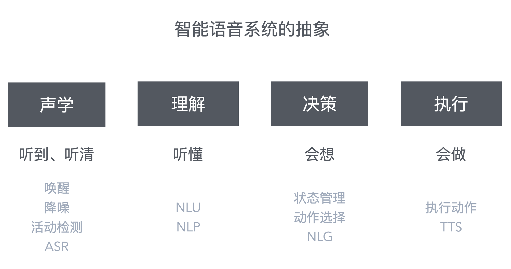


### 1) 声学

负责把物理世界的连续的音频信号稳定地转成离散的文本，负责“听到、听清”，是语音交互的“入口”。
- 物理信号 -> 文本
- **典型能力**：唤醒（KWS）、语音活动检测（VAD）、回声抵消/降噪/去混响（AEC/NS/DR）、麦阵与波束形成（可选）、语音识别（ASR）。

### 2) 理解
负责把计算机无法理解的自然语言文本 转成 计算机可以理解的结构化语义，负责 “听懂”，让系统“知道用户想要什么”。
- 文本 -> 语义
- **典型能力**：意图识别（Intent）、槽位/实体抽取（Slot/NER）、归一化（时间/地点/数值）、指代消解与上下文状态更新、多轮语义融合。

### 3) 决策

负责在用户意图与条件约束下做“下一步做什么”的执行选择，负责“会想”，给出符合用户意图的决策选择并给出对应的回复文本。

- 语义 -> 计划
- **典型形态**：传统对话管理（状态机/规则/策略学习）、Skill（路由/仲裁/API调用/NLG生成）、 LLM-based Agent（Plan/工具选择）等

### 4) 执行

负责把决策结果落到具体工具/API/TTS播报，负责“会做”，给用户实际的可交互响应。
- 计划 -> 动作
- **典型能力**：工具/API调用、TTS播报、鉴权与权限校验、参数校验、错误处理与重试。


## 五个时代

### 时代一：信号初探（1950s–1980s）

这个时期的探索主要集中在声学信号上，主要是实验室研发人员开始对数字化的音频信号进行了一些列的研究，初步总结出了一些特征，以及使用这些特征进行规则建模

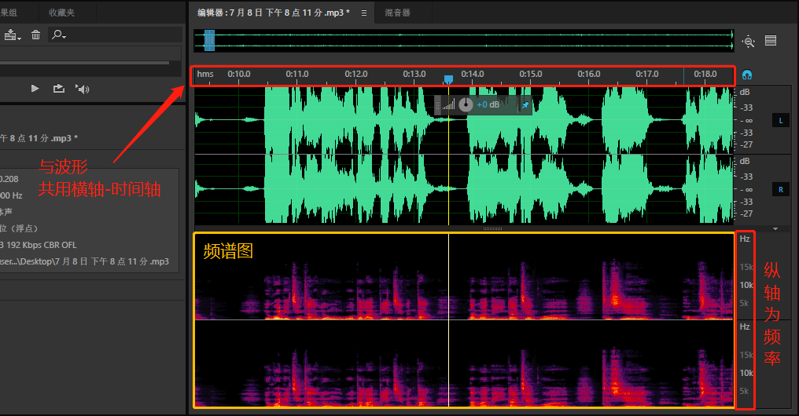

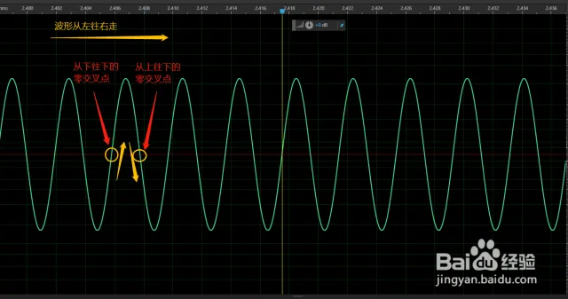

#### 架构：声音信号特征提取和规则匹配

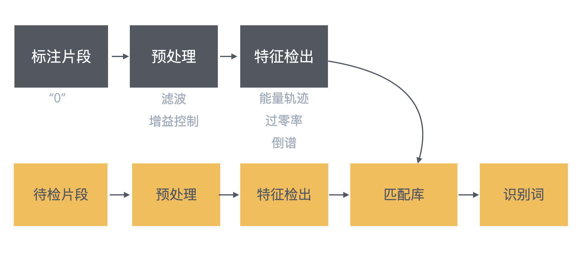

当前时代的初步结构是 “信号接收→特征粗提取→模板比对→固定检出” 的声学模块，无独立语义理解以及后续流程模块，本质是“声音与预设模板的一对一映射”。

- **信号预处理**：以简单滤波、增益控制为主，缺少系统化降噪/去混响能力；
- **典型特征**：多带通滤波器能量轨迹、短时能量与过零率、倒谱/线性预测（LPC）等谱包络特征
- **识别核心**：以模板匹配为主（多为孤立词/小词表）；DTW（“伸缩”对齐）在 1970 年代逐步成为常用的时序对齐方法，用于将输入语音与模板进行对齐与比对；

#### 代表案例与瓶颈

##### **里程碑**：
1952 年贝尔实验室的 Audrey 系统，能识别特定人说的 0–9 十个数字，但需要在安静环境、受控语速下运行。

##### **痛点**：

- 只能识别孤立词（通常仅几十词规模，<100）
- 换个人说、换个环境就不行了
- 无法理解连续语音，更别提对话

### 时代二：统计时代（1990s-2014）

随着时代进步，算力得到了很大的提升，人们对于语音的理解也更加深入，这时候开始使用基于数据统计的概率模型来进行语音各个环节的处理，计算"这段语音最可能对应哪些音素/词"，而不是死板的匹配。

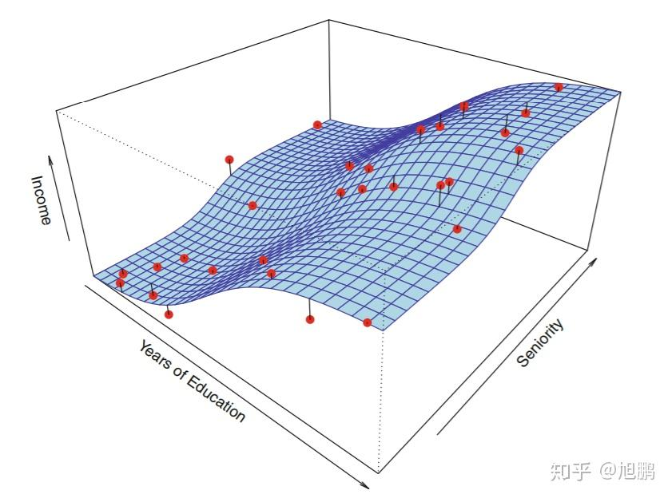

这时确立了经典的流水线架构：特征提取 → 声学模型 → 语言模型 → 语义理解 → 合成输出。

#### 架构：模块化分工的"工厂流水线"
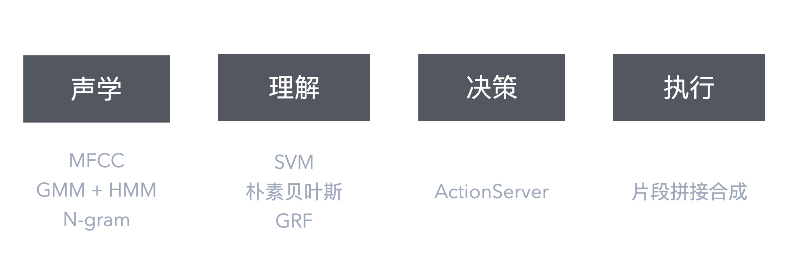


确立"特征工程→声学模型→语言模型→语义理解→语音合成"的流水线架构，各模块独立训练与优化，类似"工厂组装线"各司其职。**核心特征是从规则匹配转向概率统计驱动，但专家经验仍主导框架设计（特征工程、模型拓扑）**，实现了"连续语音识别+基础语义理解"的突破。

- **特征提取层**：人工设计梅尔频率倒谱系数（MFCC），模拟人耳对频率的感知，通过预加重、分帧、FFT提取“声学指纹”；
- **声学模型**：高斯混合模型（GMM）+隐马尔可夫模型（HMM）组合——GMM计算声学特征与音素的匹配概率，HMM处理音素序列的时序转移（解决连续语音的“音素衔接”问题）；
- **语言模型**：基于N-gram算法，通过统计大规模文本中词序列共现概率，对声学模型的多个候选结果排序，选出最符合语言习惯的词序列（如“苹果”“平果”）；
- **语义理解（NLU）**：大量依赖人工特征工程（关键词、词性、规则模板），意图识别采用支持向量机（SVM）、朴素贝叶斯等浅层机器学习分类器，槽位提取使用条件随机场（CRF）进行序列标注或基于规则的模式匹配，需要为每个领域（天气、音乐、闹钟）单独标注训练数据；
- **语音合成（TTS）**：采用“片段拼接合成”，将预录的语音片段按文本序列拼接，音色机械（MOS评分＜3.5）。

#### 示例流程：

下面用一个简单的例子来理解统计时代的语音识别流程。假设用户说出"今天天气怎么样"，系统如何把将声音识别成文字并最终执行呢？

##### **步骤1：提取声音特征（MFCC）**

麦克风录下你的声音波形，系统将其切成一小段一小段（每段约0.025秒），用MFCC算法提取每段的"声学指纹"——类似给每小段声音打上特征标签，模拟人耳对声音的感知方式。

**输出**：一串特征向量序列，可以理解为"这段声音的数学描述"。

##### **步骤2：声学模型识别音素（GMM-HMM）**

系统用声学模型（GMM-HMM）将特征序列匹配到拼音音素：
- **GMM（高斯混合模型）**：描述每个音素（如"tian"）可能对应的特征分布（考虑不同人的音色差异）
- **HMM（隐马尔可夫模型）**：处理音素的时序关系（如"天气"的发音是"tian"和"qi"连在一起）

系统通过概率计算，找到最可能的拼音序列：`jin-tian-tian-qi-zen-me-yang`

##### **步骤3：语言模型纠错（N-gram）**

声学模型可能给出多个候选：
- "今天 天气 怎么样"
- "今天 天齐 怎么样"（发音相似但不常见）
- "金田 天气 怎么样"（发音接近但罕见）

语言模型通过统计大量文本数据，发现"今天+天气"的组合出现频率远高于"今天+天齐"，从而选择最符合语言习惯的结果。

##### **步骤4：语义理解（NLU）**

ASR得到文本 `"今天天气怎么样？"` 后，需要进一步理解用户意图，将文本转为结构化语义。统计时代的NLU主要用以下方法：

**4.1 意图识别（Intent Classification）**

通过模式匹配或浅层机器学习（如SVM、朴素贝叶斯）判断用户意图：
- 特征工程：提取关键词（"天气"、"怎么样"）、词性、N-gram特征
- 分类器训练：用标注数据训练分类器，将文本映射到预定义意图
- 结果：识别为 `QUERY_WEATHER` 意图

**4.2 槽位提取（Slot Filling）**

提取关键信息，常用方法：
- **基于规则**：模式匹配（如正则表达式识别"今天"为时间）
- **条件随机场（CRF）**：序列标注模型，学习词与词之间的依赖关系

提取结果：
- 时间槽（time）：`今天`

**4.3 结构化输出**

```json
{
  "intent": "QUERY_WEATHER",
  "slots": {
    "time": "今天"
  }
}
```

##### **步骤5：决策与执行**

系统根据结构化语义调用天气服务API，获取结果后用TTS（语音合成）播报："今天北京晴，温度15-25度。"

#### 代表案例与瓶颈

##### **里程碑**：

- 1997年 Dragon NaturallySpeaking：首个消费级连续语音识别软件，开启PC端语音输入
- 2008年 Google Voice Search：移动端语音搜索起点，语音从实验室走向大众
- 2011年 Siri：首次让语音助手进入千万部手机（设备端唤醒 + 云端识别）
- 2014年 Amazon Echo：7麦克风阵列实现5-10米远场唤醒，从手机走向客厅

##### **痛点**：

- 模块割裂，误差层层累积（声学错了，后续模块无法修正）
- 人工特征工程依赖专家经验，泛化能力弱（换个说法可能识别不出）
- 冷启动困难：新领域需要大量人工标注和规则编写
- 无法处理复杂语义：多意图、嵌套逻辑、隐含信息等
- 封闭生态，功能全靠官方迭代

### 时代三：深度神经网络时代（2015-2018）**

这个阶段有两大核心特征：一是用深度神经网络逐个替换传统流水线中的人工设计模块，实现"模块级端到端化"——每个模块内部从特征到输出可学习，但模块间仍需显式对接；二是决策模块从封闭的内置功能转向开放的Skills生态，开发者可独立构建和发布技能，推动语音系统从"功能产品"向"平台生态"转变。
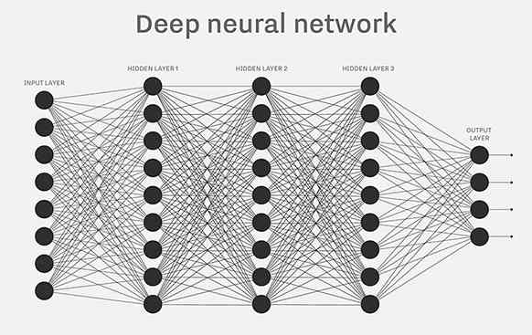

#### 架构：神经网络栈的模块化替换

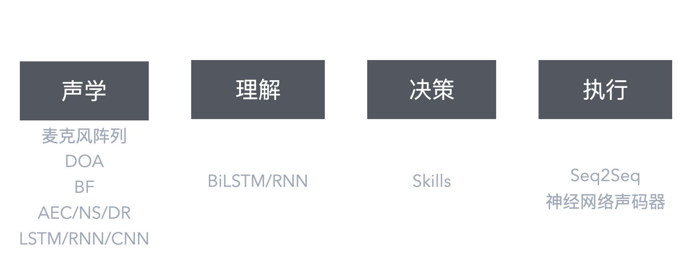

从"人工特征+统计模型"升级为"端到端神经网络栈"，但整体架构仍保持"ASR → NLU → DM → TTS"的流水线形态，各模块独立训练与优化。

- **远场语音前端成熟化**：麦克风阵列 + DOA方向估计 + 波束形成（BF）+ AEC/NS/DR（回声抵消/噪声抑制/去混响）形成完整解决方案，解决远距离、强噪声、混响以及多人同时说话的"鸡尾酒效应"问题，显著提升客厅/车载等复杂环境下的识别稳定性；
- **ASR模块级端到端**：基于LSTM/RNN的深度神经网络让ASR从"MFCC特征→GMM声学→HMM时序→N-gram解码"简化为音频→文本的单一神经网络，神经网络自动学习音频与文本的对齐关系，WER大幅下降；循环神经网络开始探索流式识别；
- **唤醒词检测（KWS）**：DNN/CNN等深度神经网络替代传统GMM，降低误唤醒和漏唤醒率，支持多唤醒词；
- **NLU初步神经化**：BiLSTM/CNN开始用于意图分类与槽位抽取，但仍依赖大量标注数据，跨域泛化能力有限；
- **决策模块生态化突破**：从封闭的内置动作映射（Intent→Action）转向开放的Skills/Actions开发生态，第三方开发者可独立定义意图、构建服务并发布技能，极大推动了语音系统从"功能产品"向"平台生态"的转变；
- **神经TTS起步**：基于Seq2Seq（LSTM + Attention）的端到端神经网络实现文本→梅尔谱的端到端建模，配合深度卷积网络声码器，自然度首次接近真人（MOS >4.0），但推理成本高。

#### 示例流程：

同样以"今天天气怎么样"为例，看看深度神经网络时代相比统计时代有哪些变化：

##### **步骤1：远场音频预处理**

用户在5米外说话，麦克风阵列采集多路音频信号，通过波束形成（BF）锁定说话方向，AEC/NS/DR模块去除回声、噪声和混响，输出干净的单通道音频。

##### **步骤2：端到端ASR识别**

基于LSTM/RNN的深度神经网络直接将音频波形转为文本 `"今天天气怎么样"`。神经网络内部自动完成特征提取、声学建模、语言建模的联合优化，不再需要MFCC→GMM→HMM→N-gram的多步骤流水线。

##### **步骤3：神经化NLU**

BiLSTM/CNN神经网络对文本进行意图分类和槽位抽取：
- **意图识别**：神经网络输出 `QUERY_WEATHER`（置信度0.95）
- **槽位抽取**：序列标注模型识别 `今天` 为时间槽


##### **步骤4：Skill路由与决策**

系统将意图路由到天气Skill，Skill内部通过人工编写的规则逻辑处理：
```python
if intent == "QUERY_WEATHER":
    location = get_user_location()  # 获取用户位置
    weather_data = call_weather_api(time="今天", location=location)
    response = generate_response(weather_data)  # 模板填槽
```

**与统计时代对比**：从封闭的内置功能转向开放的Skills生态，但决策逻辑仍需人工编写。

##### **步骤5：TTS语音合成**

基于Seq2Seq（LSTM + Attention）神经网络将回复文本 `"今天北京晴，温度15-25度"` 转为梅尔频谱，再通过深度卷积网络声码器合成自然的语音输出。

#### 消费级落地与瓶颈

**里程碑**：

- 2015-2016 年各大厂商推出深度学习版ASR，WER相比统计时代下降30-50%
- 远场语音产品大规模出货（智能音箱、车载系统）
- 2015年 Alexa Skills Kit发布，开放第三方技能开发，从封闭的内置功能转向开放平台生态，开发者数量快速增长，极大丰富了语音助手的应用场景

**痛点**：

- RNN/LSTM训练效率低，难以处理超长序列
- NLU仍依赖大量人工标注，冷启动成本高
- 跨任务迁移能力弱，每个新场景需重新训练
- 多轮对话仅支持槽位继承，不支持上下文文本继承和对话延续：基于规则/状态机的对话管理只能实现简单的槽位复用，无法理解前文语义和进行连贯对话
- Skill决策逻辑需人工编写规则，对话生成（NLG）仍依赖模板填槽，难以应对灵活多变的交互需求

---

### 时代四：Transformer与预训练时代（2019-2022）

Transformer架构的引入带来了**架构范式**的根本性变革：从RNN的序列递归转向全局自注意力，实现了并行训练、长距离依赖建模与大规模预训练的可能性。这一阶段不仅是算法升级，更是整个系统能力的质的飞跃。

预训练+微调范式成为标准，开发者无需从头训练大模型，只需在预训练模型基础上用少量数据微调即可获得优秀性能，极大降低了技术门槛，让小公司和个人也能参与NLP/语音技术开发，堪称NLP领域的"ImageNet时刻"。

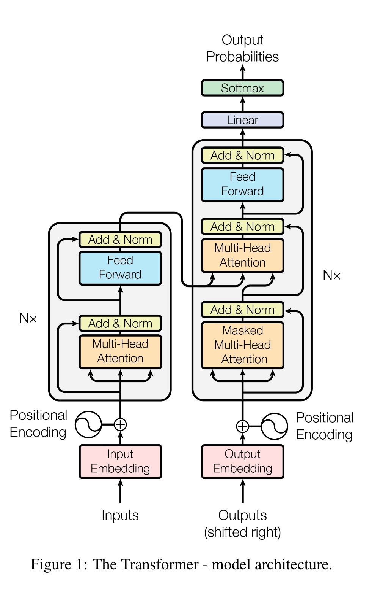

#### 架构：预训练+微调的新范式
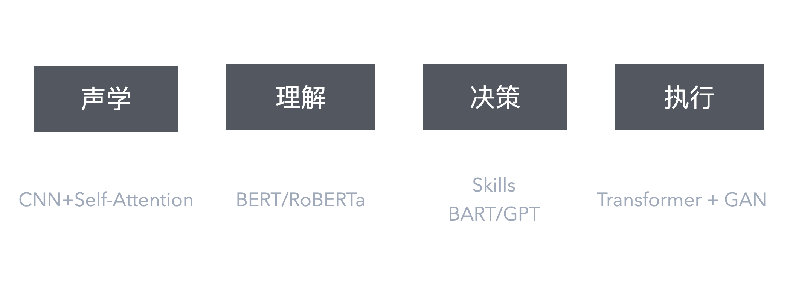


从"单任务监督训练"转向"大规模无监督预训练 + 下游任务微调"，Transformer成为语义理解和生成模块（ASR/NLU/NLG）的统一骨干架构，而远场前端、唤醒词检测等信号处理模块仍沿用深度神经网络时代的技术。**整体仍保持"ASR → NLU → DM → TTS"的流水线形态，核心变化是模块内部算法从RNN/LSTM升级为Transformer**。

- **自注意力机制引入ASR**：Conformer（2020）将卷积与自注意力结合，取代RNN的序列递归，实现并行训练与长距离依赖建模，成为ASR新标准；流式Transducer架构成熟，设备端ASR实现<500ms首字延迟；
- **预训练NLU**：BERT/RoBERTa/ERNIE等在意图分类、槽位抽取上大幅提升F1（典型提升10-15个百分点），少样本学习能力显著增强；
- **生成式NLG**：T5/BART/mT5/GPT系列用于对话生成，从模板填槽升级为灵活的自然语言生成；
- **神经TTS工业化**：声学模型引入Transformer（如FastSpeech从自回归转向非自回归并行生成），声码器引入GAN（生成对抗网络，如HiFi-GAN通过对抗训练实现高质量并行生成），两者结合让实时合成成为可能（RTF<0.1），相比深度神经网络时代WaveNet的自回归慢速生成实现质量与速度的平衡，多说话人/情感/韵律可控性大幅提升；
- **多模态探索**：语音-文本联合预训练（如Wav2Vec 2.0）开始尝试，为后续多模态大模型铺路；
- **平台工具链成熟**：Alexa Skills Kit（ASK SDK/SMAPI/ASK CLI）、AVS Device SDK生态完善，开发者可快速构建并分发技能。

#### 示例流程：

继续以"今天天气怎么样"为例，看看预训练时代相比深度神经网络时代的核心变化：

##### **步骤1：远场音频预处理**

与深度神经网络时代相同，通过麦克风阵列、波束形成、AEC/NS/DR处理后输出干净音频。

##### **步骤2：Conformer ASR识别**

基于Conformer（卷积+自注意力）的神经网络将音频转为文本 `"今天天气怎么样"`。相比LSTM/RNN：
- 自注意力机制实现全局并行建模，训练效率大幅提升
- 长距离依赖建模能力更强，识别准确率进一步提高

##### **步骤3：预训练NLU理解**

使用预训练BERT模型进行意图分类和槽位抽取：
```python
# 开发者只需少量数据微调预训练模型
pretrained_model = load_bert_pretrained()  # 加载预训练模型
finetuned_model = finetune(pretrained_model, few_shot_data)  # 用少量数据微调

# 推理
intent = finetuned_model.classify("今天天气怎么样")  # QUERY_WEATHER
slots = finetuned_model.extract_slots("今天天气怎么样")  # {time: "今天"}
```

##### **步骤4：Skill路由与决策**

与深度神经网络时代相同，仍然是基于规则的Skill路由和决策逻辑（这是该时代的瓶颈之一）。

##### **步骤5：生成式NLG**

使用T5/GPT等生成式模型生成自然回复，不再依赖固定模板，从模板填槽升级为灵活的自然语言生成，对话更自然。
```python
# 深度神经网络时代：模板填槽
response = "今天{location}{weather}，温度{temp}度"  # 机械

# 预训练时代：生成式NLG
response = generate_response(weather_data, style="friendly")  
# "今天北京的天气不错哦，晴天，温度在15到25度之间，适合出门活动~"  # 灵活自然
```

##### **步骤6：FastSpeech + HiFi-GAN合成**

声学模型（FastSpeech的Transformer）生成梅尔频谱，声码器（HiFi-GAN的GAN）合成语音，实现实时高质量输出（RTF<0.1），生成的音频更加实时、自然

#### 关键突破与瓶颈

**里程碑**：

- 2018年BERT发布，开启NLP领域"ImageNet时刻"，预训练+微调范式大幅降低技术门槛
- 2020年Conformer论文发布，迅速成为ASR业界标准
- 预训练模型让NLU冷启动时间从数周缩短至数天，小公司和个人开发者也能快速构建NLU应用
- 神经TTS达到可商用的实时性与自然度（MOS >4.3）
- 设备端推理优化让更多能力下沉到边缘

**瓶颈**：

- 预训练模型仍需大量标注数据微调
- 跨任务协同仍需人工编排（缺乏自主规划能力）
- 对话管理（DM）仍是基于规则/状态机，难以处理开放域交互
- 系统整体仍是"多模块协作"，端到端优化困难

---

### 时代五：大模型与Agent时代（2023-）

大模型时代并未改变基础模型架构（仍是Transformer），但通过**数据规模和参数量的指数级的扩张**，使模型意外的**涌现出推理能力**。这种涌现推动了语音架构的**范式转变**：从模块化流水线转向**以LLM为中枢的自主Agent系统**。
Agent系统的核心特征在于：**LLM作为推理引擎**（理解意图、规划任务、生成决策）、**工具调用能力**（主动调用API/Skill完成子任务）、**记忆与上下文管理**（维护多轮对话状态）。这一范式目前仍在快速演进中，架构形态尚未定型，但我们仍然看到过去的几年呈现出的三个阶段性方向。

回看 2023 以来的产业实践，大致能看到三条比较常见的方向。它们并不是严格的时间切片，很多能力在并行推进、互相叠加；更重要的是，“流行”只代表阶段性性价比或关注度高，并不保证最后会被证明是最优路线。

##### **趋势一：换脑与 Scaling Law（2023-2024）**
这一阶段一边是**模型侧**继续沿着 Scaling Law 拉数据与算力，把通用能力（语言理解、生成、一定程度的推理）快速抬高；另一边是**应用侧**开始做“换脑”：用 LLM 替代传统 NLU/DM，把原先靠意图/槽位/状态机硬编码的部分，改成“提示词 + 上下文 + 检索/工具”的组合来驱动对话与决策。它确实让开放域对话、长尾表达、复杂指令理解更容易了，但代价也很现实：**时延与成本抬升、输出可控性下降、评测从单点准确率转向端到端任务成功率**，因此工程上往往需要配套的防护与约束（检索增强、结构化输出、规则兜底、权限与风控）。

##### **趋势二：多模态统一与 Test-Time Scaling（2024-2025）**
在语音交互里，一个显著变化是越来越多团队尝试把“听、想、说”放进同一个模型/同一套表示里：以 **GPT-4o 这类 audio-to-audio** 为代表的端到端形态，让传统 ASR/TTS 的硬边界开始变得可选，而不是必选——这对自然度、实时性与多模态一致性很有吸引力，但也意味着训练数据、在线推理成本、端侧部署与可观测性都要重新算账。与此同时，推理侧出现了另一条路：以 **o1 这类 test-time compute / 思维链增强** 的方法为代表，通过“多想一会儿”（采样、搜索、验证、反思）换取更强的推理与解题能力。它在可验证任务上很亮眼，但是否适合实时语音产品，往往取决于**延迟预算、失败成本和是否能把推理过程产品化**（比如把“慢”变成“更稳”，而不是“更贵”）。

##### **趋势三：Agentic System 与强化学习（2025-）**
进一步往前走，行业开始更系统地搭建 Agent：从“回答一句话”转向“把事办成”，强调**计划—执行—反馈—修正**的闭环，把工具调用、记忆/上下文、任务分解、异常恢复、可观测与审计做成一套工程体系。与之配套的训练思路也在演进：在代码、数学等**可验证环境**里，RLVR 等方法带来了可见的收益，为“如何把 Agent 的行为学出来”提供了新抓手。但这条路线的边界同样清晰——现实世界任务往往难以定义可验证奖励，安全与对齐成本高，离线评测与线上灰度也更复杂；因此更像是一场“能力 + 工程 + 机制设计”的综合赛跑，而不是单纯堆模型就能结束的竞赛。

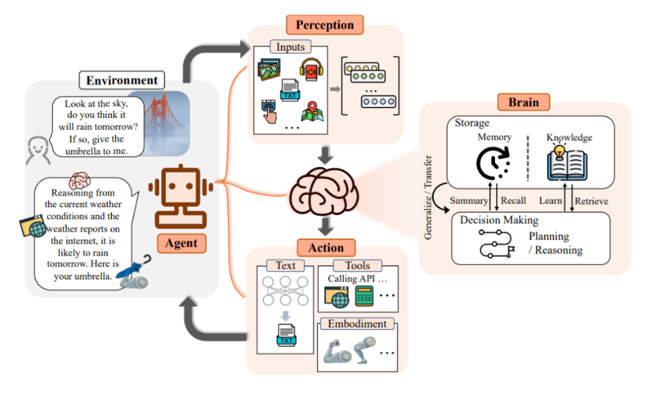


#### 架构：**Agent 系统 = LLM 负责规划决策 + 工具负责确定性执行，把对话变成“能办成事”的闭环。**

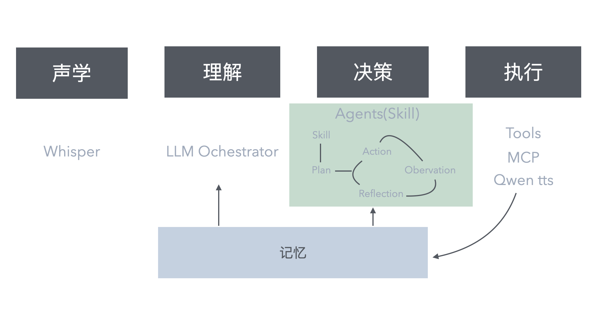

更具体一点，这个“Agent 系统”在大模型时代的模型/模块形态，常见会出现四个方向的重构（并不互斥，也不一定每个产品都需要走到最激进形态）：

1. **感知层（ASR）端到端化**：ASR 侧开始更多采用 Whisper 这类端到端模型，甚至在一些形态里被“语音-语言模型（Speech-LLM）/全模态模型”吸收，直接把语音输入映射到语义表示或可执行工具。它能显著降低传统特征工程与多模块耦合，但也会把实时性、在线成本、端侧部署与可观测性问题推到更核心的位置。
2. **理解与决策层（NLU/DM）弱化甚至跳过**：NLU 不再只能是“意图分类+槽位抽取”。常见做法是 **LLM +（轻量微调/对齐）+ 上下文/检索** 来完成理解、澄清、决策；更进一步时，系统可能不显式产出 NLU 结构，而是直接利用大模型的推理能力选择下一步动作（当然，这往往需要结构化输出、约束解码或规则兜底来保证可控性）。
3. **记忆系统（短期/长期）成为基础设施**：把多轮对话的“短期工作记忆”（当前目标、约束、上下文）与“长期记忆”（偏好、画像、历史任务与重要事实）分层管理，通过写入策略、检索召回与过期纠错机制，向理解与决策层提供更稳定的上下文参考。它的价值不在“记得更多”，而在**记得准、给得对**（避免把幻觉或噪声固化进长期记忆）。
4. **业务 Agent 层走向 Hybrid（编排 + 自规划）**：真正落到业务决策时，纯“全自动自规划”并不总是性价比最高。很多团队会采用 **人为编排（流程/策略/模板）+ 自规划（在局部空间搜索/补齐）** 的混合形态：关键路径可控、长尾靠模型兜底。与此同时，“Skill/Tool 描述”变得更重要——它不仅是功能入口，也是在给自规划 Agent 注入**背景、边界、偏好与可用知识**，让规划更像“在规则内自由发挥”。
5. **执行与表达层（Tools + TTS）确定性增强**：执行侧越来越强调“确定性”：通过 MCP 这类协议把外部能力标准化成可调用、可审计、可回滚的工具；表达侧则更多采用端到端的 text-to-audio（例如 Qwen TTS 等）来生成更自然的人声回复，配合流式输出、可打断、低延迟的交互体验。整体上是“概率决策在上层，确定性执行在下层”。


#### 示例流程：

同样以"今天天气怎么样"为例，看看大模型与Agent时代相比预训练时代的根本性变化：

##### **步骤1：多模态感知（可选端到端路径）**

用户在5米外说话，系统有两种处理路径：

**路径A（传统流水线）**：远场音频预处理 → Whisper等端到端ASR → 文本 `"今天天气怎么样"`

**路径B（端到端多模态）**：音频直接输入GPT-4o等多模态大模型 → 跳过ASR，直接理解语音语义

##### **步骤2：LLM Orchestrator 选择 Agent**

LLM Orchestrator 作为路由层，负责根据用户输入选择合适的 Agent：

```python
# 构建Orchestrator上下文
context = {
    "user_input": "今天天气怎么样",
    "conversation_history": [...],  # 短期记忆：最近3轮对话
    "available_agents": [
        {
            "name": "weather_agent",
            "description": "处理天气查询相关任务，包括当前天气、天气预报、空气质量等",
            "capabilities": ["get_weather", "get_user_location"]
        },
        {
            "name": "music_agent",
            "description": "处理音乐播放、搜索、推荐等任务",
            "capabilities": ["play_music", "search_song", "control_playback"]
        },
        {
            "name": "general_agent",
            "description": "处理通用对话、问答、闲聊等任务",
            "capabilities": ["chat", "qa", "general_knowledge"]
        }
    ]
}

# LLM Orchestrator 进行路由决策
response = llm.chat(
    system_prompt="""你是一个智能语音助手的Orchestrator。
    根据用户输入，你需要：
    1. 理解用户意图
    2. 从可用的Agent列表中选择最合适的Agent来处理该任务
    3. 输出选择的Agent名称""",
    user_message=context
)
```

**Orchestrator 输出**：
```json
{
  "selected_agent": "weather_agent",
  "confidence": 0.95,
  "reasoning": "用户询问天气信息，weather_agent专门处理此类任务"
}
```

##### **步骤3：Agent 加载 Skill 并制定计划**

根据 Orchestrator 的选择，weather_agent 加载对应的 weather_skill，Skill 定义了 Agent 的背景知识、遵循的事实、可用的工具以及预设的计划模板：

```python
# weather_agent 加载 weather_skill
weather_skill = {
    "name": "weather_skill",
    "background_knowledge": """
    - 天气查询需要明确时间和地点两个关键信息
    - 如果用户未指定地点，优先使用用户当前位置
    - 如果用户未指定时间，默认为今天
    - 天气信息包括：温度、天气状况、湿度、风速等
    """,
    "facts": [
        "用户位置信息存储在user_profile中",
        "天气API需要location和time参数",
        "回复应该友好、简洁、包含关键信息"
    ],
    "available_tools": [
        {
            "name": "get_user_location",
            "description": "获取用户当前位置",
            "parameters": {},
            "returns": "location (string)"
        },
        {
            "name": "get_weather",
            "description": "查询指定时间和地点的天气信息",
            "parameters": {
                "location": "string, 必填",
                "time": "string, 可选，默认为'今天'"
            },
            "returns": "weather_data (dict)"
        }
    ],
    "plan_templates": [
        "如果缺少location → 调用get_user_location → 调用get_weather → 生成回复",
        "如果location和time都明确 → 调用get_weather → 生成回复"
    ]
}

# Agent 基于 Skill 制定计划
agent_plan = weather_agent.plan(
    user_input="今天天气怎么样",
    skill=weather_skill,
    conversation_history=[...],
    user_profile={...}
)
```

**Agent 基于 Skill 制定计划的过程**：
```
用户问"今天天气怎么样"
→ 加载 weather_skill，获取背景知识和可用工具
→ 分析：这是一个天气查询需求，time="今天"已明确，但location缺失
→ 根据 plan_templates，选择模板1：缺少location → 先获取位置 → 再查询天气 → 生成回复
→ 制定执行计划：
   1. 调用 get_user_location() 获取用户位置
   2. 调用 get_weather(location=步骤1结果, time="今天")
   3. 基于返回结果生成友好回复（作为计划的一部分）
```

##### **步骤4：执行-观察-反思循环**

Agent 按照计划执行工具调用，然后观察结果并反思，必要时调整计划：

```python
# 第一轮：执行计划的第一步
step1_result = weather_agent.execute_tool(
    tool="get_user_location",
    parameters={}
)
# 观察结果
observation1 = {
    "tool": "get_user_location",
    "result": "北京",
    "status": "success"
}

# Agent 反思：第一步成功，可以继续
weather_agent.reflect(
    plan=agent_plan,
    observations=[observation1],
    current_step=1
)
# 反思结果：计划正常，继续执行步骤2

# 第二轮：执行计划的第二步
step2_result = weather_agent.execute_tool(
    tool="get_weather",
    parameters={
        "location": observation1["result"],  # "北京"
        "time": "今天"
    }
)
# 观察结果
observation2 = {
    "tool": "get_weather",
    "result": {
        "location": "北京",
        "date": "2025-01-15",
        "weather": "晴",
        "temperature": {"min": 15, "max": 25},
        "humidity": 60,
        "wind_speed": "5km/h"
    },
    "status": "success"
}

# Agent 反思：前两步完成，继续执行第三步（生成回复）
weather_agent.reflect(
    plan=agent_plan,
    observations=[observation1, observation2],
    current_step=2
)
# 反思结果：数据收集完成，执行步骤3：生成回复

# 第三轮：执行计划的第三步（生成回复）
response = weather_agent.generate_response(
    skill=weather_skill,  # 包含背景知识和遵循的事实
    observations=[observation1, observation2],  # 工具执行结果
    conversation_history=[...],
    user_profile={...}
)
# 观察结果
observation3 = {
    "action": "generate_response",
    "result": "今天北京天气很不错呢，晴朗的一天，气温在15到25度之间。对了，您上次说想去爬香山，今天就是个好日子哦~要不要帮您查一下公交路线？",
    "status": "success"
}

# Agent 反思：所有步骤完成，任务达成
weather_agent.reflect(
    plan=agent_plan,
    observations=[observation1, observation2, observation3],
    current_step=3
)
# 反思结果：计划全部完成，任务成功

# 表达侧（TTS）：将生成的文本转为语音
# 端到端路径：直接使用GPT-4o等模型的audio-to-audio能力，或使用Qwen TTS等端到端text-to-audio模型
tts_output = tts.synthesize(observation3["result"])

# 更新记忆系统
query = "今天天气怎么样"  # 用户输入
memory.update_short_term(query=query, tts_output=tts_output)
memory.update_long_term(user_preference="常用地点：北京")
```

#### 代表案例与瓶颈

##### 产品实践

1. **豆包手机** 
2. **豆包、ChatGPT**
3. **Cursor / Claude Code**

##### 瓶颈

一句话概括：难点往往不在“能不能做”，而在“能不能**稳定、可控、可规模化**地做”。

- **成本与时延**：多模态、长上下文、test-time compute 和多次工具调用会同时抬高推理成本与端到端延迟。  
- **可靠性与可控性（幻觉/漂移）**：一旦理解/决策出错，错误会在多步链路里被放大且更难兜底。  
- **工具调用工程复杂度**：真正的失败常来自权限、超时、幂等、依赖波动与一致性问题，而不是“不会调用”。  
- **记忆治理**：长期记忆易被噪声或幻觉污染、短期记忆易爆上下文，写入/检索/过期策略不当会反噬效果。  
- **评测体系**：从单点指标转向端到端成功率后，复现、归因与回放成本显著上升。  
- **黑盒与不可解释性**：决策依据与中间推理难以解释和审计，排障、合规与建立用户信任的成本更高。  
- **安全与合规**：可执行工具让系统具备“真实影响力”，必须默认具备最小权限、审计与敏感操作确认。  
- **数据与对齐**：多模态与工具数据难规模化沉淀，现实业务的奖励函数也更难定义与对齐。  

## 核心洞察
### 1. 从专家知识驱动到数据驱动
回头看这条演进路径，最根本的变化其实是“能力从哪里来”。规则时代靠专家手工写规则、调特征，系统能做多聪明，基本取决于专家能把多少经验显式化；统计学习时代开始由数据来“填参数”，但专家仍然在设计框架（比如特征、HMM 拓扑）；深度学习把特征学习也交给模型，工程与研究的重心逐渐转向网络结构与训练方法；到了大模型时代，架构形态越来越趋同（Transformer 几乎成了默认），真正拉开差距的往往是数据的规模、质量，以及围绕数据构建的工程能力。

于是三件事同时发生：能力的天花板被抬高（模型能学到很多专家也说不清的模式），迭代节奏被加快（从周级迭代变成日级甚至小时级），竞争要素也在迁移（从“算法技巧”转向“数据 + 算力 + 工程闭环”）。对应地，“专家”的定义也变了：不再只是规则设计者，更像是数据治理的负责人和系统架构师。

### 2. 端到端演进与优化重心上移
架构的变化可以从两个维度来理解。横向上，它不断走向端到端：从模块内的多段流水线（MFCC→GMM→HMM→N-gram），到单一神经网络（CTC/Tacotron），再到系统级端到端（例如 audio in/out 的范式，逐步消解 ASR→NLU→DM→TTS 的传统边界）。更重要的是，端到端网络结构往往意味着更少的人为切分与手工“过桥”特征：减少那些为了对齐模块接口而做的维度降低与中间表征压缩，从源头降低信息损失与误差累积。纵向上，优化重心确实在上移：当底层识别能力逐渐进入收益递减、甚至被平台化/通用化之后，系统的成败更多由上层的“目标达成闭环”决定——怎么管理上下文、怎么做任务规划、怎么调用工具并校验结果，以及在失败时如何回退与澄清。关键不再只是把声音转成更准的文本，而是把一次交互稳稳落到可执行的结果上。

背后的机制更准确地说是：**可学习的范围在不断扩张，系统边界也在被反复重划**。一方面，越来越多原本靠人工拆分与手工规则“钉死”的环节被模型端到端吸收；另一方面，为了稳定、可控、可审计，也会把一部分能力从模型里“收回来”，交给更确定的工程与工具约束。随之而来，系统竞争力也从单点工程优化，转向更接近“认知建模”的能力：如何理解目标、如何规划路径、如何在复杂环境里稳稳落地。

### 3. 从识别理解到任务规划
从能力形态看，语音系统大致经历了三次跃迁：规则时代更多是固定映射（声音→响应）；统计/深度学习时代把重点放在语义理解（文本→意图+槽位→单一功能）；而大模型与 Agent 时代，则把“规划”推到了舞台中央（意图→多步计划→跨服务编排→目标达成）。

这本质上是系统智能的“上移”：先解决“他说了什么”，再解决“他想要什么”，最后要解决“怎么把这件事办成”。LLM 把推理能力注入了决策层：能拆任务、能调用工具、能在多轮对话中维护上下文与记忆。于是语音不再只是一个输入方式，而逐渐变成承载任务、驱动执行的交互载体。

### 4. 向概率系统演进
另一个容易被低估的变化，是系统从“确定性”走向“概率性”。规则时代的行为几乎完全可预测；统计时代虽然底层是概率模型，但上层决策常常依然是确定逻辑；到了大模型时代，LLM 的输出天然带采样属性，Agent 的规划路径也未必固定，多模态融合又引入更多不确定性——整个链路逐渐变成端到端的概率系统。
概率系统并不可怕，关键是学会“驾驭概率”：一方面把概率采样带来的上限与泛化性释放出来，另一方面把下限兜住——让“更准确、少胡编”变成可预期的常态，而不是靠运气。与此同时，概率性也会倒逼产品认知发生变化：它不再是那种“同样输入必须得到完全一致输出”的确定性系统，产品要学会围绕不确定性做交互（比如允许合理的多解、在关键点主动澄清、在风险处更保守）。
除了上述变化，驯化概率系统的过程中我们常常忽视——工程侧的不确定性。因为一旦执行链路本身不稳定，概率性决策的波动就会被放大，最终很容易走向：**概率性决策 × 不确定性工程 → 决策灾难**。
因此，越是概率系统，工程架构越要追求更高的确定性与稳定性：执行层要可预期（超时、重试、权限、回滚、审计回放这些“基础件”得标准化）；高风险操作默认防呆（确认与分级授权）；同时把可观测性做完整（能记录、能回放、能解释）。最后，测试与评估范式也会随之改变：不再是“链路跑通=功能完成”，而需要用统计口径去刻画系统状态与退化趋势，比如任务成功率、稳定性分布、以及类似 `pass@1`（乃至 `pass@k`）这类反映“在给定采样预算下能否命中正确解”的指标。

### 5. 专业分工的模糊化
最后是组织与协作方式的变化。大模型把很多原本清晰的模块边界打散了，**产品、研发、算法、测试**这些角色的边界也在一起变得模糊：产品不再只写需求，还要设计“问不清就追问、风险高就更保守”的交互；研发不再只把 API 接好，还要考虑模型会怎么推理、怎么把任务一步步执行下去；算法不再只把模型调好，还要考虑怎么写提示、怎么让模型用工具；测试也不再只盯单次准确率，而要验证“任务能不能完成、过程稳不稳定”。

很多团队会从“专业化分工”走向“端到端小队”：每个角色都要对全链路有基本理解，小队对一个场景从头到尾负责到底，才能把一个概率系统做得稳、做得可控。某种意义上，这也是“逆康威定律”的结果，在系统架构往端到端演进的时候时，组织架构是没法仍然保持原有的分工，还能很好的运转。

# 相关引用：

1. The Path Ahead for Agentic AI: Challenges and Opportunities https://arxiv.org/html/2601.02749v1

2. 语音智能体商业落地的教训、经验与实践 https://www.bilibili.com/video/BV1dZsCzfEMV?spm_id_from=333.788.videopod.sections&vd_source=ea6d84de12429b878dff8d7a0fa03636

3. 
